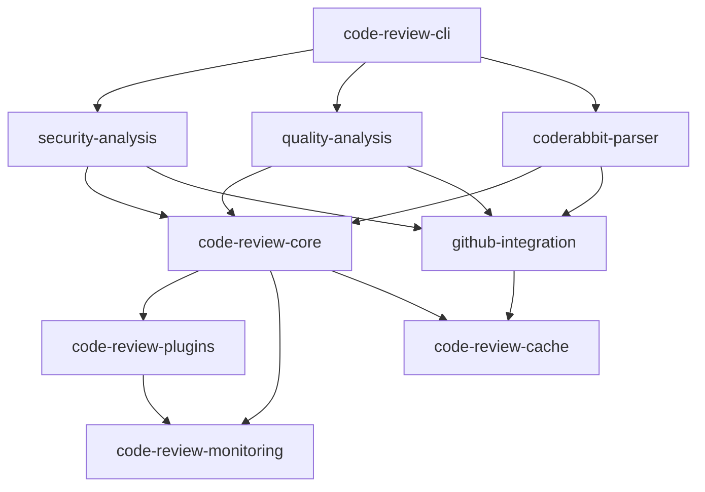

# Architecture Specification

This is the architecture specification for the spec detailed in @.agent-os/specs/2025-08-14-code-review-future-enhancements/spec.md

> Created: 2025-08-14
> Version: 1.0.0

## High-Level Architecture

### System Overview

```
┌─────────────────────────────────────────────────────────────┐
│                         CLI Layer                            │
│                    @studio/code-review-cli                   │
├─────────────────────────────────────────────────────────────┤
│                      Analysis Layer                          │
│  ┌─────────────────┐  ┌─────────────────┐  ┌─────────────┐ │
│  │    Security     │  │     Quality     │  │  CodeRabbit │ │
│  │    Analysis     │  │    Analysis     │  │    Parser   │ │
│  └─────────────────┘  └─────────────────┘  └─────────────┘ │
├─────────────────────────────────────────────────────────────┤
│                        Core Layer                            │
│  ┌─────────────────┐  ┌─────────────────┐  ┌─────────────┐ │
│  │      Core       │  │     GitHub      │  │   Plugins   │ │
│  │    Utilities    │  │   Integration   │  │    System   │ │
│  └─────────────────┘  └─────────────────┘  └─────────────┘ │
├─────────────────────────────────────────────────────────────┤
│                   Infrastructure Layer                       │
│  ┌─────────────────┐  ┌─────────────────┐  ┌─────────────┐ │
│  │   Monitoring    │  │     Cache       │  │Rate Limiter │ │
│  │    Service      │  │    Manager      │  │   Service   │ │
│  └─────────────────┘  └─────────────────┘  └─────────────┘ │
└─────────────────────────────────────────────────────────────┘
```

### Package Relationships



## Component Architecture

### CLI Component

```
@studio/code-review-cli/
├── commands/
│   ├── analyze.ts         # Main analysis command
│   ├── report.ts          # Report generation
│   ├── config.ts          # Configuration management
│   └── plugin.ts          # Plugin management
├── utils/
│   ├── output.ts          # Output formatting
│   ├── input.ts           # Input validation
│   └── config-loader.ts   # Config file loading
└── index.ts               # CLI entry point
```

### Security Analysis Component

```
@studio/security-analysis/
├── analyzers/
│   ├── credentials.ts     # Credential detection
│   ├── vulnerabilities.ts # Vulnerability scanning
│   ├── dependencies.ts    # Dependency analysis
│   └── patterns.ts        # Pattern matching
├── rules/
│   ├── builtin/          # Built-in security rules
│   └── custom/           # Custom rule loader
├── scoring/
│   └── risk-calculator.ts # Risk scoring algorithm
└── index.ts              # Public API
```

### Plugin System Component

```
@studio/code-review-plugins/
├── manager/
│   ├── loader.ts         # Plugin loading
│   ├── validator.ts      # Plugin validation
│   └── lifecycle.ts      # Lifecycle management
├── sandbox/
│   ├── vm.ts            # VM sandbox
│   ├── context.ts       # Plugin context
│   └── permissions.ts   # Permission system
├── api/
│   ├── types.ts         # Plugin API types
│   └── helpers.ts       # Helper functions
└── index.ts             # Plugin system API
```

## Data Flow Architecture

### Analysis Pipeline

```
Input (PR Number)
        ↓
┌───────────────┐
│  Validation   │
└───────┬───────┘
        ↓
┌───────────────┐
│ Cache Check   │──→ [Cache Hit] → Results
└───────┬───────┘
        ↓
┌───────────────┐
│  Fetch Code   │
└───────┬───────┘
        ↓
┌───────────────────────┐
│  Parallel Analysis    │
│ ┌─────┐ ┌─────┐ ┌───┐│
│ │Sec. │ │Qual.│ │CR ││
│ └─────┘ └─────┘ └───┘│
└───────┬───────────────┘
        ↓
┌───────────────┐
│Plugin Pipeline│
└───────┬───────┘
        ↓
┌───────────────┐
│  Aggregation  │
└───────┬───────┘
        ↓
┌───────────────┐
│ Cache Update  │
└───────┬───────┘
        ↓
    Results
```

### Caching Architecture

```
┌─────────────────────────────────────┐
│         Cache Request               │
└─────────────┬───────────────────────┘
              ↓
┌─────────────────────────────────────┐
│      L1: Memory Cache (LRU)         │
│         (Hot Data)                  │
└─────────────┬───────────────────────┘
              ↓ [Miss]
┌─────────────────────────────────────┐
│      L2: Disk Cache (SQLite)        │
│      (Warm Data)                    │
└─────────────┬───────────────────────┘
              ↓ [Miss]
┌─────────────────────────────────────┐
│      L3: Redis Cache                │
│      (Shared Cache)                 │
└─────────────┬───────────────────────┘
              ↓ [Miss]
         Compute Result
```

### Monitoring Architecture

```
┌──────────────┐     ┌──────────────┐     ┌──────────────┐
│  Application │────▶│  Telemetry   │────▶│   Backends   │
│     Code     │     │   Library    │     │              │
└──────────────┘     └──────────────┘     └──────────────┘
                            │                      │
                     ┌──────┴──────┐       ┌──────┴──────┐
                     │   Traces    │       │  Prometheus │
                     │   (Jaeger)  │       │   Grafana   │
                     └─────────────┘       └─────────────┘
```

## Security Architecture

### Plugin Sandboxing

```
┌─────────────────────────────────────┐
│         Plugin Code                 │
└─────────────┬───────────────────────┘
              ↓
┌─────────────────────────────────────┐
│      Permission Check               │
└─────────────┬───────────────────────┘
              ↓
┌─────────────────────────────────────┐
│        VM2 Sandbox                  │
│   ┌─────────────────────────┐       │
│   │   Restricted Context    │       │
│   │   - No file system      │       │
│   │   - No network          │       │
│   │   - Limited CPU/Memory  │       │
│   └─────────────────────────┘       │
└─────────────┬───────────────────────┘
              ↓
         Safe Execution
```

### API Security

```
Request
   ↓
┌─────────────┐
│ Rate Limit  │──→ [Exceeded] → 429 Error
└─────┬───────┘
      ↓
┌─────────────┐
│   Auth      │──→ [Failed] → 401 Error
└─────┬───────┘
      ↓
┌─────────────┐
│ Validation  │──→ [Invalid] → 400 Error
└─────┬───────┘
      ↓
   Process
```

## Deployment Architecture

### Container Structure

```
┌─────────────────────────────────────┐
│         Docker Container            │
│  ┌─────────────────────────────┐    │
│  │     Node.js Application     │    │
│  └─────────────────────────────┘    │
│  ┌─────────────────────────────┐    │
│  │      Health Checks          │    │
│  └─────────────────────────────┘    │
│  ┌─────────────────────────────┐    │
│  │     Metrics Endpoint        │    │
│  └─────────────────────────────┘    │
└─────────────────────────────────────┘
         ↓            ↓
    [Port 3000]  [Port 9090]
     (Service)    (Metrics)
```

### Kubernetes Deployment

```yaml
apiVersion: apps/v1
kind: Deployment
metadata:
  name: code-review-service
spec:
  replicas: 3
  template:
    spec:
      containers:
        - name: code-review
          image: studio/code-review:latest
          ports:
            - containerPort: 3000 # Service
            - containerPort: 9090 # Metrics
          livenessProbe:
            httpGet:
              path: /health/live
              port: 3000
          readinessProbe:
            httpGet:
              path: /health/ready
              port: 3000
```

## Scalability Considerations

### Horizontal Scaling

- Stateless service design
- Shared cache via Redis
- Queue-based job distribution
- Load balancer compatible

### Vertical Scaling

- Memory-efficient data structures
- Stream processing for large files
- Lazy loading of analysis modules
- Resource pooling

### Performance Targets

- Analysis latency: <5s for small PRs, <30s for large PRs
- Cache hit rate: >80% for repeated analyses
- API throughput: 100 requests/second
- Plugin execution: <1s per plugin
- Memory usage: <512MB baseline, <2GB under load

## Integration Points

### CI/CD Integration

```
GitHub Actions / GitLab CI / Jenkins
                ↓
        ┌──────────────┐
        │  Webhook     │
        └──────┬───────┘
               ↓
        ┌──────────────┐
        │Code Review   │
        │   Service    │
        └──────┬───────┘
               ↓
        ┌──────────────┐
        │  PR Comment  │
        │   Status     │
        └──────────────┘
```

### External Services

- GitHub API (code, PRs, comments)
- CodeRabbit API (analysis)
- OpenAI/Anthropic (AI analysis)
- Sentry (error tracking)
- DataDog/NewRelic (APM)
