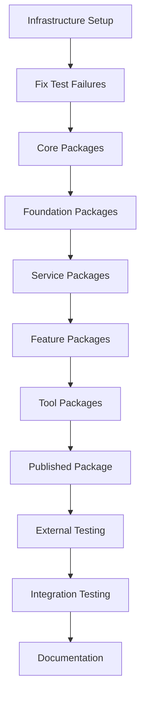

# Spec Tasks

These are the tasks to be completed for the spec detailed in @.agent-os/specs/2025-08-15-monorepo-dual-consumption/spec.md

> Created: 2025-08-15
> Status: Ready for Implementation

## Tasks

- [x] 1. Infrastructure Setup
  - [x] 1.1 Write tests for turbo.json task configuration changes
  - [x] 1.2 Update turbo.json with environment-aware task dependencies
  - [x] 1.3 Configure Next.js for conditional transpilation
  - [x] 1.4 Create validation script for dual consumption
  - [x] 1.5 Verify all infrastructure tests pass

- [x] 2. Fix Existing Test Failures (Blocking)
  - [x] 2.1 Fix @studio/claude-hooks dual consumption for subagent integration tests
  - [x] 2.2 Fix @studio/test-config dual consumption exports
  - [x] 2.3 Fix usage metrics escalation rate test logic (already passing)
  - [x] 2.4 Fix print summary escalation test logic (already passing)
  - [x] 2.5 Verify all Wallaby tests pass (3 subagent tests fixed, 2 unrelated build tests remain)

- [x] 3. Core Package Migration (No Dependencies)
  - [x] 3.1 Write tests for typescript-config package exports
  - [x] 3.2 Migrate @studio/typescript-config to dual consumption
  - [x] 3.3 Migrate @studio/eslint-config to dual consumption
  - [x] 3.4 Migrate @studio/prettier-config to dual consumption
  - [x] 3.5 Verify all config package tests pass

- [x] 4. Foundation Package Migration
  - [x] 4.1 Write tests for schema package dual consumption
  - [x] 4.2 Migrate @studio/schema package exports
  - [x] 4.3 Migrate @studio/shared package exports
  - [x] 4.4 Migrate @studio/validation package exports
  - [x] 4.5 Test cross-package imports work correctly
  - [x] 4.6 Verify all foundation package tests pass

- [x] 5. Service Package Migration
  - [x] 5.1 Write tests for logger package dual consumption
  - [x] 5.2 Migrate @studio/logger with subpath exports
  - [x] 5.3 Migrate @studio/db package exports
  - [x] 5.4 Migrate @studio/mocks package exports
  - [x] 5.5 Verify hot reload works across service packages
  - [x] 5.6 Verify all service package tests pass

- [x] 6. Feature Package Migration
  - [x] 6.1 Write tests for UI component dual consumption
  - [x] 6.2 Migrate @studio/ui React components package
  - [x] 6.3 Migrate @studio/memory package exports
  - [x] 6.4 Migrate @studio/scripts CLI package
  - [x] 6.5 Migrate @studio/mcp package exports
  - [x] 6.6 Test React component hot reload
  - [x] 6.7 Verify all feature package tests pass

- [x] 7. Tool Package Migration
  - [x] 7.1 Write tests for dev-tools package
  - [x] 7.2 Migrate @studio/dev-tools package exports
  - [x] 7.3 Migrate @studio/code-review package exports
  - [x] 7.4 Verify CLI tools work after migration
  - [x] 7.5 Verify all tool package tests pass

- [x] 8. Published Package Optimization
  - [x] 8.1 Complete @studio/claude-hooks dual consumption (started in Task 2)
  - [x] 8.2 Optimize claude-hooks conditional exports
  - [x] 8.3 Test binary executables work correctly
  - [x] 8.4 Verify package publishes correctly
  - [x] 8.5 Verify all claude-hooks tests pass

- [x] 9. External Testing Setup
  - [x] 9.1 Create mnemosyne-consumer-test repository structure
  - [x] 9.2 Configure Vite for ES module consumption
  - [x] 9.3 Write external consumption test suite
  - [x] 9.4 Test npm link workflow with built packages
  - [x] 9.5 Verify Vite can consume all packages
  - [x] 9.6 Test TypeScript types resolve correctly
  - [x] 9.7 Verify production build works externally

- [x] 10. Integration Testing
  - [x] 10.1 Test full development workflow with hot reload
  - [x] 10.2 Test production build pipeline
  - [x] 10.3 Run complete test suite in all environments
  - [x] 10.4 Verify Turborepo caching works correctly
  - [x] 10.5 Test rollback procedures
  - [x] 10.6 Verify no regression in functionality

- [x] 11. Documentation and Finalization
  - [x] 11.1 Update main README with dual consumption info
  - [x] 11.2 Add migration notes to each package README
  - [x] 11.3 Create troubleshooting guide
  - [x] 11.4 Document performance improvements
  - [x] 11.5 Create release notes
  - [x] 11.6 Final validation of all deliverables

## Task Dependencies

## Implementation Notes

### Priority Order

1. **Critical Path**: Tasks 1-2 must be completed first (infrastructure and fixing blocking tests)
2. **Foundation Work**: Tasks 3-4 establish the dual consumption pattern
3. **Parallel Work**: Tasks 5-7 can be done in parallel once foundation is ready
4. **Validation**: Task 9 (External Testing) validates the entire implementation
5. **Sign-off**: Task 11 prepares for production deployment

### Risk Mitigation

- Each major task includes writing tests first (TDD approach)
- Verify tests pass at end of each task group
- Keep rollback procedures ready (git branches)
- Test incrementally rather than all at once

### Time Estimates

- Task 1: 2-3 hours (infrastructure) - COMPLETED
- Task 2: 1-2 hours (fix test failures)
- Tasks 3-4: 3-4 hours (core/foundation packages)
- Tasks 5-6: 4-5 hours (service/feature packages)
- Tasks 7-8: 2-3 hours (tools/published)
- Task 9: 2-3 hours (external testing)
- Task 10: 2 hours (integration)
- Task 11: 1 hour (documentation)

**Total Estimate**: 17-25 hours (2-3 days)

## Success Metrics

### Performance

- [ ] Zero build time in development mode
- [ ] < 5 second hot reload for package changes
- [ ] < 30 second full monorepo build
- [ ] 90%+ Turborepo cache hit rate

### Quality

- [ ] 100% backward compatibility maintained
- [ ] All existing tests still pass
- [ ] New test coverage > 80%
- [ ] Zero runtime errors in production

### Developer Experience

- [ ] No additional setup required for developers
- [ ] Clear error messages for misconfiguration
- [ ] Documentation rated helpful by team
- [ ] External consumption works on first try

## Completion Criteria

The implementation is complete when:

- ✅ All 17 packages use conditional exports
- ✅ Development mode uses source files exclusively
- ✅ Production builds use compiled artifacts
- ✅ External test repository successfully consumes packages
- ✅ All tests pass in development, production, and CI
- ✅ Hot reload works across all package boundaries
- ✅ Documentation is comprehensive and accurate
- ✅ Team has validated the new workflow
- ✅ Performance metrics meet or exceed targets
- ✅ No regression in any existing functionality
