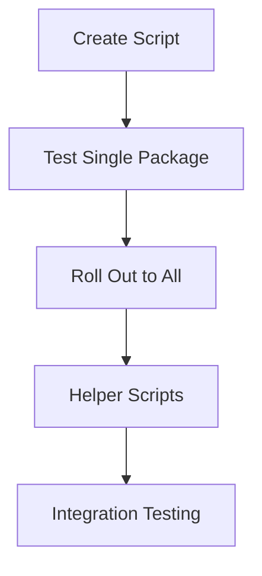

# Spec Tasks

These are the tasks to be completed for the spec detailed in @.agent-os/specs/2025-08-15-post-processing-esm-fix/spec.md

> Created: 2025-08-15
> Status: Ready for Implementation

## Tasks

- [x] 1. Create Post-Processing Script
  - [x] 1.1 Write tests for fix-esm-extensions script
  - [x] 1.2 Create scripts/fix-esm-extensions.js with core functionality
  - [x] 1.3 Test script with sample JavaScript files
  - [x] 1.4 Verify all import patterns are handled correctly
  - [x] 1.5 Run script tests and ensure all pass

- [ ] 2. Test with Single Package
  - [ ] 2.1 Choose @studio/logger as pilot package
  - [ ] 2.2 Update package.json build script to include post-processing
  - [ ] 2.3 Build package and verify output has .js extensions
  - [ ] 2.4 Test that the package runs without import errors
  - [ ] 2.5 Verify existing package tests still pass

- [ ] 3. Roll Out to All Packages
  - [ ] 3.1 Update build scripts for all library packages
  - [ ] 3.2 Build all packages with the new script
  - [ ] 3.3 Run all package tests to ensure compatibility
  - [ ] 3.4 Test CLI binaries work correctly

- [ ] 4. Create Helper Scripts
  - [ ] 4.1 Create fix-all-extensions.js for monorepo-wide processing
  - [ ] 4.2 Add convenience scripts to root package.json
  - [ ] 4.3 Test monorepo-wide script execution
  - [ ] 4.4 Document script usage

- [ ] 5. Integration Testing
  - [ ] 5.1 Write integration tests for build pipeline
  - [ ] 5.2 Test cross-package imports work correctly
  - [ ] 5.3 Verify CLI tools execute without errors
  - [ ] 5.4 Test npm link functionality
  - [ ] 5.5 Run all integration tests and ensure they pass

## Task Dependencies

## Implementation Notes

### Critical Path

1. **Script First**: Must work correctly before any package updates
2. **Single Package Test**: Validates approach with low risk
3. **Gradual Rollout**: Apply to all packages once proven
4. **Helper Scripts**: Convenience for developers
5. **Full Testing**: Ensure everything works end-to-end

### Risk Mitigation

- Test script thoroughly before using
- Start with one package to minimize risk
- Keep original build scripts as backup
- Document any edge cases found
- Easy rollback - just remove script from build

### Key Principles

1. **Simplicity**: One script, one purpose
2. **Transparency**: Clear what the script does
3. **Compatibility**: Works with existing tools
4. **Reversibility**: Easy to remove if needed
5. **Testability**: Comprehensive test coverage

## Time Estimates

- Task 1: 2 hours (script creation and testing)
- Task 2: 1 hour (single package validation)
- Task 3: 2 hours (rollout to all packages)
- Task 4: 1 hour (helper scripts)
- Task 5: 2 hours (integration testing)

**Total Estimate**: 8 hours (1 day)

## Success Metrics

### Functionality

- [ ] All imports have .js extensions in dist/
- [ ] Source files remain clean (no .js)
- [ ] All packages build successfully
- [ ] CLI tools execute without errors

### Performance

- [ ] Script execution < 200ms per package
- [ ] Total build overhead < 1 second
- [ ] No memory leaks

### Quality

- [ ] All existing tests pass
- [ ] No runtime import errors
- [ ] Source maps still work
- [ ] Hot reload unaffected

## Completion Criteria

The implementation is complete when:

- ✅ Script handles all import patterns
- ✅ All packages build with the script
- ✅ No runtime ES module errors
- ✅ All tests pass
- ✅ CLI tools work correctly
- ✅ Documentation is complete
- ✅ Team understands the approach

## Rollback Plan

If issues arise:

1. **Immediate**: Remove script from build commands
2. **Temporary**: Add .js extensions manually where needed
3. **Full rollback**: `git revert` the implementation

This is the simplest possible rollback - just stop using the script.

## Notes

This is a pragmatic, low-risk approach that:

- Keeps the existing TypeScript compilation process
- Adds minimal complexity (one simple script)
- Is easy to understand and debug
- Can be easily rolled back if needed
- Solves the ES module extension problem without introducing bundlers

The beauty of this solution is its simplicity - it does one thing well and doesn't try to be clever.
