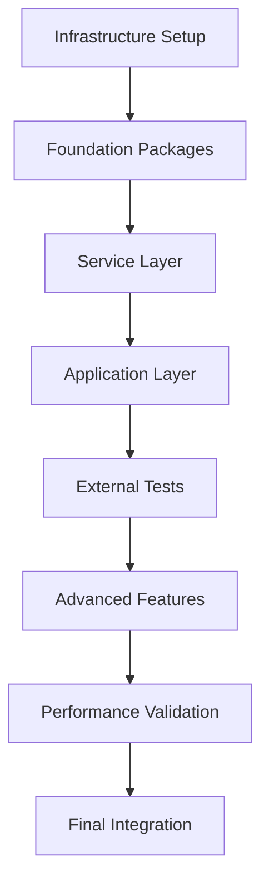

# Spec Tasks

These are the tasks to be completed for the spec detailed in @.agent-os/specs/2025-08-16-bun-migration-complete/spec.md

> Created: 2025-08-16
> Status: Ready for Implementation

## Tasks

- [ ] 1. Infrastructure Setup and Preparation
  - [ ] 1.1 Install Bun v1.1.38+ on all development machines
  - [ ] 1.2 Create bunfig.toml configuration in project root
  - [ ] 1.3 Set up Bun in GitHub Actions CI/CD pipeline
  - [ ] 1.4 Create performance baseline measurements with current Node.js setup
  - [ ] 1.5 Create migration branch: `feature/bun-migration`
  - [ ] 1.6 Document current build times and test execution times
  - [ ] 1.7 Set up external test package structure
  - [ ] 1.8 Verify all infrastructure tests pass
  - [ ] 1.9 Refactor environment detection patterns
    - [ ] 1.9.1 Replace all NODE_ENV checks with Bun.env
    - [ ] 1.9.2 Update process.env usage to Bun.env
    - [ ] 1.9.3 Create Bun-specific environment utilities
    - [ ] 1.9.4 Update all conditional imports based on env

- [ ] 2. Foundation Package Migration
  - [ ] 2.1 Write tests for @studio/schema Bun migration
  - [ ] 2.2 Migrate @studio/schema to Bun
  - [ ] 2.3 Migrate @studio/logger and remove ALL .js extensions
  - [ ] 2.4 Migrate @studio/shared package
  - [ ] 2.5 Migrate @studio/validation package
  - [ ] 2.6 Create and run extension cleanup script
    - [ ] 2.6.1 Remove ALL .js extensions from TypeScript imports
    - [ ] 2.6.2 Delete fix-shebangs.js from packages/claude-hooks/scripts/
    - [ ] 2.6.3 Delete fix-shebangs.js from packages/dev-tools/scripts/
    - [ ] 2.6.4 Remove shebang fixing from all package.json build scripts
    - [ ] 2.6.5 Update bin entries to use Bun-compiled binaries
  - [ ] 2.7 Verify all foundation packages build < 1 second
  - [ ] 2.8 Run all foundation package tests and ensure they pass
  - [ ] 2.9 Simplify TypeScript configuration for Bun
    - [ ] 2.9.1 Remove "composite": true from tsconfig files
    - [ ] 2.9.2 Remove or simplify project references
    - [ ] 2.9.3 Update moduleResolution to Bun's requirements
    - [ ] 2.9.4 Remove outDir/rootDir (no compilation needed)
    - [ ] 2.9.5 Update base TypeScript config for Bun compatibility
  - [ ] 2.10 Modernize path resolution
    - [ ] 2.10.1 Replace all \_\_dirname with import.meta.dirname (41 files)
    - [ ] 2.10.2 Replace \_\_filename with import.meta.filename
    - [ ] 2.10.3 Remove fileURLToPath imports (27 files)
    - [ ] 2.10.4 Update all path.join to use Bun.pathToFileURL where needed
    - [ ] 2.10.5 Simplify all import.meta.url usage

- [ ] 3. Service Layer Migration
  - [ ] 3.1 Write tests for @studio/db Prisma integration with Bun
  - [ ] 3.2 Migrate @studio/db with special Prisma handling
  - [ ] 3.3 Migrate @studio/mocks with MSW compatibility
  - [ ] 3.4 Migrate @studio/test-config to Bun test runner
  - [ ] 3.5 Update all test configurations for Bun
  - [ ] 3.6 Verify cross-package imports work correctly
  - [ ] 3.7 Run integration tests across service layer
  - [ ] 3.8 Ensure all service layer tests pass
  - [ ] 3.9 Implement Prisma-Bun compatibility layer (CRITICAL)
    - [ ] 3.9.1 Create custom generate script using bunx
    - [ ] 3.9.2 Handle workspace protocol issues
    - [ ] 3.9.3 Test with both in-memory and file databases
    - [ ] 3.9.4 Create Docker setup with Node.js fallback
    - [ ] 3.9.5 Document Prisma-specific workarounds
    - [ ] 3.9.6 Add shamefully-hoist configuration if needed

- [ ] 4. Application Layer Migration
  - [ ] 4.1 Write tests for @studio/ui component compilation
  - [ ] 4.2 Migrate @studio/ui with React/JSX configuration
  - [ ] 4.3 Migrate @studio/claude-hooks package
    - [ ] 4.3.1 Remove fix-shebangs.js script
    - [ ] 4.3.2 Update package.json build script to remove shebang fixing
    - [ ] 4.3.3 Convert bin entries to Bun compilation targets
    - [ ] 4.3.4 Test all CLI tools work with Bun runtime
  - [ ] 4.4 Compile claude-hooks CLI tools to native binaries
  - [ ] 4.5 Test binary execution and performance
  - [ ] 4.6 Migrate @studio/memory package
  - [ ] 4.7 Migrate @studio/scripts package
  - [ ] 4.8 Verify all application layer tests pass
  - [ ] 4.9 Complete testing infrastructure migration
    - [ ] 4.9.1 Migrate all 19 vitest.config.ts files to Bun test
    - [ ] 4.9.2 Convert Wallaby.js config to Bun-compatible
    - [ ] 4.9.3 Replace MSW with Bun's native mocking
    - [ ] 4.9.4 Update all test scripts to use bun test
    - [ ] 4.9.5 Migrate happy-dom to Bun's DOM implementation
    - [ ] 4.9.6 Convert all vi.mock() to Bun's mock syntax

- [ ] 5. External Test Package Implementation
  - [ ] 5.1 Create @studio/test-external package structure
  - [ ] 5.2 Write import resolution tests (no .js extensions)
    - [ ] 5.2.1 Verify NO .js extensions needed anywhere
    - [ ] 5.2.2 Verify shebangs are handled automatically
    - [ ] 5.2.3 Verify TypeScript executes directly without build
    - [ ] 5.2.4 Test that old Node.js patterns fail appropriately
  - [ ] 5.3 Write binary compilation tests
  - [ ] 5.4 Write NPM link consumption tests
  - [ ] 5.5 Create Vite app fixture for testing
  - [ ] 5.6 Write cross-package integration tests
  - [ ] 5.7 Write performance benchmark suite
  - [ ] 5.8 Run all external tests and ensure 100% pass
  - [ ] 5.9 Replace all TSX/ts-node usage
    - [ ] 5.9.1 Replace 16+ tsx scripts with direct bun execution
    - [ ] 5.9.2 Update all npx tsx to bun run
    - [ ] 5.9.3 Remove tsx and ts-node dependencies
    - [ ] 5.9.4 Update all package.json scripts
    - [ ] 5.9.5 Test all CLI tools work directly with Bun

- [ ] 6. Advanced Features Implementation
  - [ ] 6.1 Set up edge runtime compatibility (Cloudflare Workers)
  - [ ] 6.2 Configure Deno Deploy compatibility
  - [ ] 6.3 Implement AI-assisted development tools
  - [ ] 6.4 Set up security hardening features
  - [ ] 6.5 Implement performance monitoring dashboard
  - [ ] 6.6 Configure multi-layer caching system
  - [ ] 6.7 Set up automated performance optimization
  - [ ] 6.8 Verify all advanced features work correctly
  - [ ] 6.9 Eliminate all CommonJS patterns
    - [ ] 6.9.1 Convert wallaby.cjs to ES modules or Bun format
    - [ ] 6.9.2 Convert .eslintrc.cjs files to .mjs
    - [ ] 6.9.3 Remove all require() calls (found in 20+ files)
    - [ ] 6.9.4 Remove all module.exports patterns
    - [ ] 6.9.5 Update all dynamic requires to dynamic imports

- [ ] 7. Performance Validation and Optimization
  - [ ] 7.1 Run comprehensive performance benchmarks
  - [ ] 7.2 Verify 10x improvement in build times
  - [ ] 7.3 Verify 10x improvement in test execution
  - [ ] 7.4 Verify 20x improvement in HMR
  - [ ] 7.5 Verify 3x reduction in memory usage
  - [ ] 7.6 Document all performance improvements
  - [ ] 7.7 Create performance comparison report
  - [ ] 7.8 Ensure all performance targets are met
  - [ ] 7.9 Implement production monitoring (CRITICAL)
    - [ ] 7.9.1 Add memory usage tracking
    - [ ] 7.9.2 Create memory leak detection tests
    - [ ] 7.9.3 Set up performance regression tests
    - [ ] 7.9.4 Document memory management best practices
    - [ ] 7.9.5 Create alerts for memory spikes
    - [ ] 7.9.6 Test 24-hour memory stability

- [ ] 8. Final Integration and Deployment
  - [ ] 8.1 Run full monorepo build with Bun
  - [ ] 8.2 Run all tests across all packages
  - [ ] 8.3 Test CI/CD pipeline with Bun
  - [ ] 8.4 Deploy test application to staging
  - [ ] 8.5 Perform security audit
  - [ ] 8.6 Update all documentation
  - [ ] 8.7 Create migration guide for team
  - [ ] 8.8 Merge to main branch
  - [ ] 8.9 Clean up Node.js-specific configurations
    - [ ] 8.9.1 Remove all TypeScript build configurations
    - [ ] 8.9.2 Delete dist/ directories (except for binary outputs)
    - [ ] 8.9.3 Remove transpilePackages from Next.js config
    - [ ] 8.9.4 Update turbo.json to remove build dependencies for type-check
    - [ ] 8.9.5 Remove "type": "module" from package.json files (Bun doesn't need it)
    - [ ] 8.9.6 Clean up dual consumption exports (simplify for Bun)
    - [ ] 8.9.7 Remove all ES module workarounds and polyfills
  - [ ] 8.10 Next.js Specific Migration
    - [ ] 8.10.1 Remove next.config.ts transpilePackages completely
    - [ ] 8.10.2 Update to Bun's built-in JSX transform
    - [ ] 8.10.3 Configure Bun for Next.js App Router
    - [ ] 8.10.4 Test SSR/SSG with Bun runtime
    - [ ] 8.10.5 Optimize for Bun's faster static generation
    - [ ] 8.10.6 Address potential memory leaks in long-running processes

## Task Dependencies



## Implementation Timeline

### Phase 1: Setup and Foundation (Day 1)

- Task 1: Infrastructure Setup (4 hours)
- Task 2: Foundation Packages (4 hours)

### Phase 2: Core Migration (Day 2-3)

- Task 3: Service Layer (4 hours)
- Task 4: Application Layer (4 hours)
- Task 5: External Tests (4 hours)

### Phase 3: Advanced Features (Day 4)

- Task 6: Advanced Features (8 hours)

### Phase 4: Validation and Deployment (Day 5)

- Task 7: Performance Validation (4 hours)
- Task 8: Final Integration (4 hours)

**Total Estimated Time**: 40 hours (5 days)

## Critical Gotchas From Real Migrations

### Known Issues & Solutions

1. **Prisma Generation Fails** (Most Common)
   - Issue: `prisma generate` tries to use npm in Bun environment
   - Solution: Use `bunx prisma generate` or install Node.js in Docker
   - Workaround: Add `shamefully-hoist=true` to .npmrc for workspace issues

2. **Memory Leaks in Production**
   - Issue: Next.js apps can leak memory with Bun runtime
   - Solution: Monitor memory for 24+ hours before production
   - Mitigation: Set memory limits and auto-restart policies

3. **MSW Doesn't Work for SSR**
   - Issue: Mock Service Worker can't intercept server-side requests
   - Solution: Use Bun's native fetch mocking instead
   - Alternative: Conditional mocking based on runtime environment

4. **Wallaby.js Incompatibility**
   - Issue: Wallaby may not work with Bun test runner
   - Solution: Prepare migration to Bun test first
   - Fallback: Keep Vitest config for Wallaby temporarily

5. **TypeScript Paths Don't Work**
   - Issue: Turborepo recommends against TS project references
   - Solution: Use Node.js subpath imports instead
   - Best Practice: Each package should be independent

## Critical Success Factors

### Must-Have Completions

- ✅ Zero .js extension errors
- ✅ All packages build with Bun
- ✅ All tests pass (including 24hr memory test)
- ✅ External test package validates everything
- ✅ Native binaries compile successfully
- ✅ 10x performance improvement achieved
- ✅ Prisma working with workarounds documented
- ✅ Memory stable in production workloads

### Risk Mitigation

1. **Prisma Compatibility**
   - Risk: Prisma client generation issues
   - Mitigation: Custom build script with special handling
   - Fallback: Keep Node.js for Prisma operations only

2. **MSW Compatibility**
   - Risk: Mock Service Worker incompatibility
   - Mitigation: External dependency handling
   - Fallback: Alternative mocking solution

3. **CI/CD Pipeline**
   - Risk: GitHub Actions Bun support
   - Mitigation: Use official oven-sh/setup-bun action
   - Fallback: Docker containers with Bun

4. **Team Adoption**
   - Risk: Learning curve for developers
   - Mitigation: Comprehensive documentation and training
   - Fallback: Gradual migration with Node.js compatibility

## Validation Checklist

After each major task:

- [ ] Build succeeds in < 1 second
- [ ] Tests pass in < 500ms
- [ ] No .js extensions in source or imports
- [ ] No shebang fix scripts remaining
- [ ] No TypeScript compilation for runtime execution
- [ ] Binary compilation works for all CLI tools
- [ ] Direct TypeScript execution in all contexts
- [ ] Zero CommonJS patterns remaining
- [ ] Zero Node.js-specific APIs (unless wrapped)
- [ ] All **dirname/**filename replaced
- [ ] No TSX/ts-node dependencies
- [ ] Prisma working in all environments
- [ ] MSW replaced with Bun mocking
- [ ] Memory usage stable over 24hrs
- [ ] Memory usage < 100MB
- [ ] External tests pass
- [ ] Performance benchmarks met
- [ ] Security audit clean
- [ ] Documentation updated

## Rollback Plan

If critical issues arise:

1. **Immediate Rollback** (< 5 minutes)

   ```bash
   git checkout main
   pnpm install
   pnpm build
   ```

2. **Partial Rollback** (< 30 minutes)
   - Keep Bun for development
   - Use Node.js for production
   - Maintain dual compatibility

3. **Gradual Rollback** (< 1 day)
   - Revert packages one by one
   - Identify specific issues
   - Fix and retry migration

## Success Metrics

### Performance Metrics

| Metric     | Target      | Actual | Status |
| ---------- | ----------- | ------ | ------ |
| Build Time | < 1s/pkg    | TBD    | ⏳     |
| Test Time  | < 500ms/pkg | TBD    | ⏳     |
| HMR Time   | < 50ms      | TBD    | ⏳     |
| Memory     | < 100MB     | TBD    | ⏳     |
| Startup    | < 50ms      | TBD    | ⏳     |

### Quality Metrics

| Metric         | Target | Actual | Status |
| -------------- | ------ | ------ | ------ |
| Test Pass Rate | 100%   | TBD    | ⏳     |
| .js Extensions | 0      | TBD    | ⏳     |
| Binary Compile | 100%   | TBD    | ⏳     |
| External Tests | 100%   | TBD    | ⏳     |
| Security       | Clean  | TBD    | ⏳     |

## Team Communication

### Stakeholder Updates

- Daily standup updates during migration
- Slack channel: #bun-migration
- Weekly demo of progress
- Final presentation of results

### Documentation Deliverables

1. Migration Guide
2. Performance Report
3. Lessons Learned
4. Best Practices
5. Troubleshooting Guide

## Post-Migration Tasks

After successful migration:

1. Remove Node.js dependencies
2. Update CI/CD pipelines
3. Train team on Bun
4. Monitor production performance
5. Document new workflows
6. Celebrate! 🎉

## Migration Priority Order (Revised Based on Real-World Learnings)

### Recommended Sequence

1. **Infrastructure & Environment** (Tasks 1.1-1.9)
   - Set up Bun, create baselines, prepare environment detection

2. **Scripts & CLI Tools** (Task 5.9)
   - Replace TSX/ts-node early to validate Bun execution
   - Lower risk, immediate validation

3. **Foundation Packages** (Tasks 2.1-2.10)
   - No external dependencies, easier migration
   - Path resolution and TypeScript cleanup

4. **Testing Infrastructure** (Task 4.9)
   - Critical but complex - do before service layer
   - MSW replacement needs early attention

5. **Service Layer EXCEPT Prisma** (Tasks 3.1-3.8, skip 3.9)
   - Migrate everything except Prisma initially
   - Validate cross-package imports work

6. **Application Layer** (Tasks 4.1-4.8)
   - UI components, memory package, etc.

7. **Prisma Migration** (Task 3.9 - DO LAST)
   - Most problematic, needs all workarounds ready
   - Have Node.js fallback prepared

8. **Advanced Features & Optimization** (Tasks 6-7)
   - After core migration stable

9. **Production Deployment** (Task 8)
   - With full monitoring and rollback ready

## Notes

This migration represents a paradigm shift in our development workflow:

- **From**: TypeScript → Compile → Node.js → Run
- **To**: TypeScript → Bun (direct execution)

The elimination of the compilation step alone will save hundreds of developer hours annually.

### Key Innovations

1. **Native Binary Compilation** - Deploy without runtime dependencies
2. **Edge Runtime Support** - Run anywhere (Cloudflare, Deno, browsers)
3. **AI Integration** - Local LLM for code generation
4. **Security Hardening** - Runtime permission system
5. **Performance Monitoring** - Real-time metrics dashboard

This is not just a tool migration - it's a complete modernization of our development stack.
