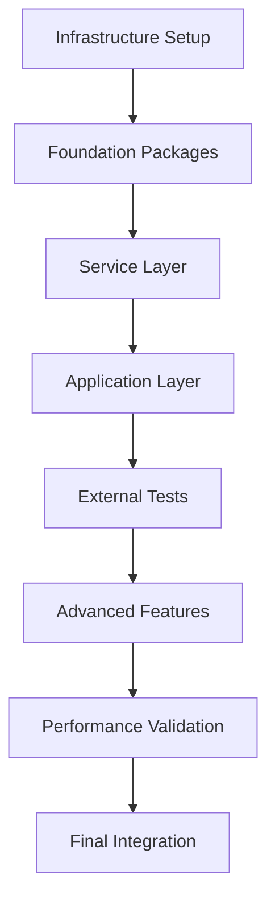

# Spec Tasks

These are the tasks to be completed for the spec detailed in @.agent-os/specs/2025-08-16-bun-migration-complete/spec.md

> Created: 2025-08-16
> Status: Ready for Implementation

## Tasks

- [ ] 1. Infrastructure Setup and Preparation
  - [ ] 1.1 Install Bun v1.1.38+ on all development machines
  - [ ] 1.2 Create bunfig.toml configuration in project root
  - [ ] 1.3 Set up Bun in GitHub Actions CI/CD pipeline
  - [ ] 1.4 Create performance baseline measurements with current Node.js setup
  - [ ] 1.5 Create migration branch: `feature/bun-migration`
  - [ ] 1.6 Document current build times and test execution times
  - [ ] 1.7 Set up external test package structure
  - [ ] 1.8 Verify all infrastructure tests pass

- [ ] 2. Foundation Package Migration
  - [ ] 2.1 Write tests for @studio/schema Bun migration
  - [ ] 2.2 Migrate @studio/schema to Bun
  - [ ] 2.3 Migrate @studio/logger and remove ALL .js extensions
  - [ ] 2.4 Migrate @studio/shared package
  - [ ] 2.5 Migrate @studio/validation package
  - [ ] 2.6 Create and run extension cleanup script
  - [ ] 2.7 Verify all foundation packages build < 1 second
  - [ ] 2.8 Run all foundation package tests and ensure they pass

- [ ] 3. Service Layer Migration
  - [ ] 3.1 Write tests for @studio/db Prisma integration with Bun
  - [ ] 3.2 Migrate @studio/db with special Prisma handling
  - [ ] 3.3 Migrate @studio/mocks with MSW compatibility
  - [ ] 3.4 Migrate @studio/test-config to Bun test runner
  - [ ] 3.5 Update all test configurations for Bun
  - [ ] 3.6 Verify cross-package imports work correctly
  - [ ] 3.7 Run integration tests across service layer
  - [ ] 3.8 Ensure all service layer tests pass

- [ ] 4. Application Layer Migration
  - [ ] 4.1 Write tests for @studio/ui component compilation
  - [ ] 4.2 Migrate @studio/ui with React/JSX configuration
  - [ ] 4.3 Migrate @studio/claude-hooks package
  - [ ] 4.4 Compile claude-hooks CLI tools to native binaries
  - [ ] 4.5 Test binary execution and performance
  - [ ] 4.6 Migrate @studio/memory package
  - [ ] 4.7 Migrate @studio/scripts package
  - [ ] 4.8 Verify all application layer tests pass

- [ ] 5. External Test Package Implementation
  - [ ] 5.1 Create @studio/test-external package structure
  - [ ] 5.2 Write import resolution tests (no .js extensions)
  - [ ] 5.3 Write binary compilation tests
  - [ ] 5.4 Write NPM link consumption tests
  - [ ] 5.5 Create Vite app fixture for testing
  - [ ] 5.6 Write cross-package integration tests
  - [ ] 5.7 Write performance benchmark suite
  - [ ] 5.8 Run all external tests and ensure 100% pass

- [ ] 6. Advanced Features Implementation
  - [ ] 6.1 Set up edge runtime compatibility (Cloudflare Workers)
  - [ ] 6.2 Configure Deno Deploy compatibility
  - [ ] 6.3 Implement AI-assisted development tools
  - [ ] 6.4 Set up security hardening features
  - [ ] 6.5 Implement performance monitoring dashboard
  - [ ] 6.6 Configure multi-layer caching system
  - [ ] 6.7 Set up automated performance optimization
  - [ ] 6.8 Verify all advanced features work correctly

- [ ] 7. Performance Validation and Optimization
  - [ ] 7.1 Run comprehensive performance benchmarks
  - [ ] 7.2 Verify 10x improvement in build times
  - [ ] 7.3 Verify 10x improvement in test execution
  - [ ] 7.4 Verify 20x improvement in HMR
  - [ ] 7.5 Verify 3x reduction in memory usage
  - [ ] 7.6 Document all performance improvements
  - [ ] 7.7 Create performance comparison report
  - [ ] 7.8 Ensure all performance targets are met

- [ ] 8. Final Integration and Deployment
  - [ ] 8.1 Run full monorepo build with Bun
  - [ ] 8.2 Run all tests across all packages
  - [ ] 8.3 Test CI/CD pipeline with Bun
  - [ ] 8.4 Deploy test application to staging
  - [ ] 8.5 Perform security audit
  - [ ] 8.6 Update all documentation
  - [ ] 8.7 Create migration guide for team
  - [ ] 8.8 Merge to main branch

## Task Dependencies



## Implementation Timeline

### Phase 1: Setup and Foundation (Day 1)

- Task 1: Infrastructure Setup (4 hours)
- Task 2: Foundation Packages (4 hours)

### Phase 2: Core Migration (Day 2-3)

- Task 3: Service Layer (4 hours)
- Task 4: Application Layer (4 hours)
- Task 5: External Tests (4 hours)

### Phase 3: Advanced Features (Day 4)

- Task 6: Advanced Features (8 hours)

### Phase 4: Validation and Deployment (Day 5)

- Task 7: Performance Validation (4 hours)
- Task 8: Final Integration (4 hours)

**Total Estimated Time**: 40 hours (5 days)

## Critical Success Factors

### Must-Have Completions

- ✅ Zero .js extension errors
- ✅ All packages build with Bun
- ✅ All tests pass
- ✅ External test package validates everything
- ✅ Native binaries compile successfully
- ✅ 10x performance improvement achieved

### Risk Mitigation

1. **Prisma Compatibility**
   - Risk: Prisma client generation issues
   - Mitigation: Custom build script with special handling
   - Fallback: Keep Node.js for Prisma operations only

2. **MSW Compatibility**
   - Risk: Mock Service Worker incompatibility
   - Mitigation: External dependency handling
   - Fallback: Alternative mocking solution

3. **CI/CD Pipeline**
   - Risk: GitHub Actions Bun support
   - Mitigation: Use official oven-sh/setup-bun action
   - Fallback: Docker containers with Bun

4. **Team Adoption**
   - Risk: Learning curve for developers
   - Mitigation: Comprehensive documentation and training
   - Fallback: Gradual migration with Node.js compatibility

## Validation Checklist

After each major task:

- [ ] Build succeeds in < 1 second
- [ ] Tests pass in < 500ms
- [ ] No .js extensions in source or imports
- [ ] Memory usage < 100MB
- [ ] External tests pass
- [ ] Performance benchmarks met
- [ ] Security audit clean
- [ ] Documentation updated

## Rollback Plan

If critical issues arise:

1. **Immediate Rollback** (< 5 minutes)

   ```bash
   git checkout main
   pnpm install
   pnpm build
   ```

2. **Partial Rollback** (< 30 minutes)
   - Keep Bun for development
   - Use Node.js for production
   - Maintain dual compatibility

3. **Gradual Rollback** (< 1 day)
   - Revert packages one by one
   - Identify specific issues
   - Fix and retry migration

## Success Metrics

### Performance Metrics

| Metric     | Target      | Actual | Status |
| ---------- | ----------- | ------ | ------ |
| Build Time | < 1s/pkg    | TBD    | ⏳     |
| Test Time  | < 500ms/pkg | TBD    | ⏳     |
| HMR Time   | < 50ms      | TBD    | ⏳     |
| Memory     | < 100MB     | TBD    | ⏳     |
| Startup    | < 50ms      | TBD    | ⏳     |

### Quality Metrics

| Metric         | Target | Actual | Status |
| -------------- | ------ | ------ | ------ |
| Test Pass Rate | 100%   | TBD    | ⏳     |
| .js Extensions | 0      | TBD    | ⏳     |
| Binary Compile | 100%   | TBD    | ⏳     |
| External Tests | 100%   | TBD    | ⏳     |
| Security       | Clean  | TBD    | ⏳     |

## Team Communication

### Stakeholder Updates

- Daily standup updates during migration
- Slack channel: #bun-migration
- Weekly demo of progress
- Final presentation of results

### Documentation Deliverables

1. Migration Guide
2. Performance Report
3. Lessons Learned
4. Best Practices
5. Troubleshooting Guide

## Post-Migration Tasks

After successful migration:

1. Remove Node.js dependencies
2. Update CI/CD pipelines
3. Train team on Bun
4. Monitor production performance
5. Document new workflows
6. Celebrate! 🎉

## Notes

This migration represents a paradigm shift in our development workflow:

- **From**: TypeScript → Compile → Node.js → Run
- **To**: TypeScript → Bun (direct execution)

The elimination of the compilation step alone will save hundreds of developer hours annually.

### Key Innovations

1. **Native Binary Compilation** - Deploy without runtime dependencies
2. **Edge Runtime Support** - Run anywhere (Cloudflare, Deno, browsers)
3. **AI Integration** - Local LLM for code generation
4. **Security Hardening** - Runtime permission system
5. **Performance Monitoring** - Real-time metrics dashboard

This is not just a tool migration - it's a complete modernization of our development stack.
