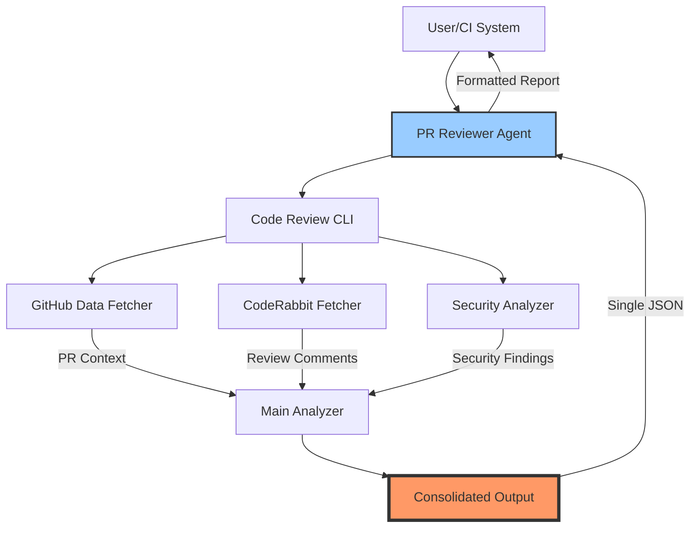
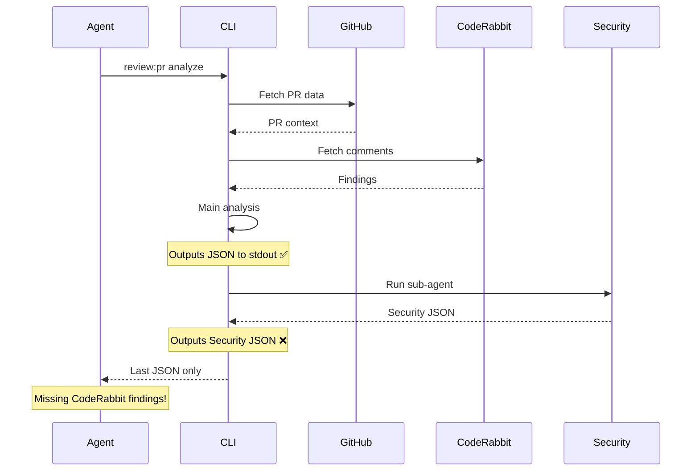
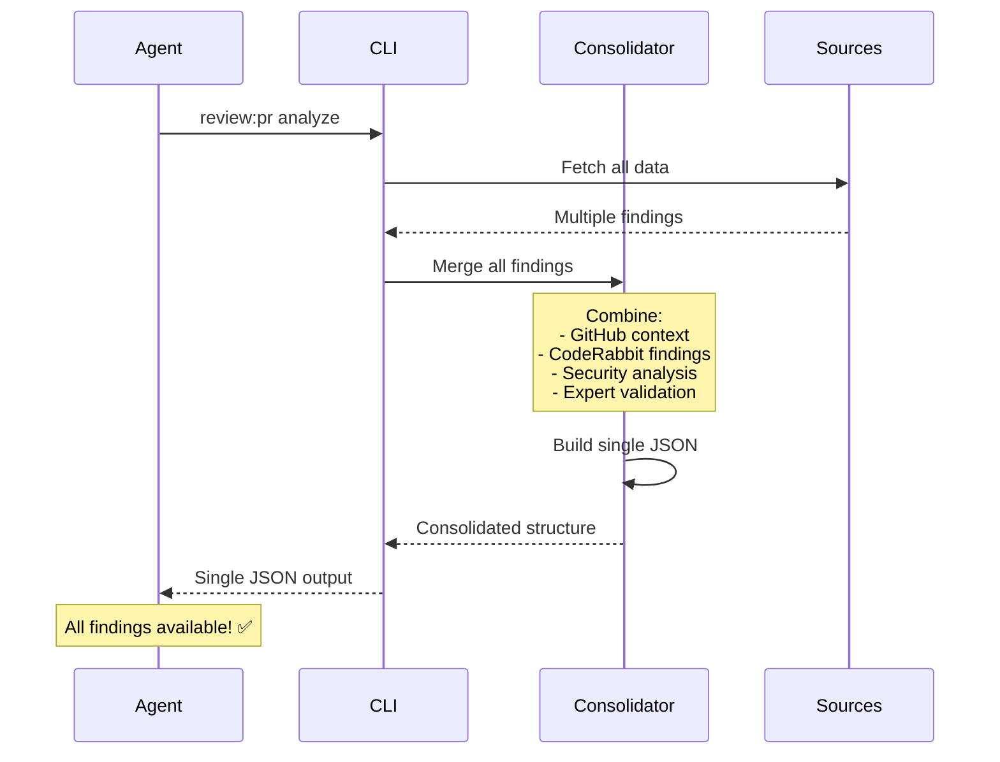

# Technical Specification

This is the technical specification for the spec detailed in @.agent-os/specs/2025-08-16-code-review-production/spec.md

> Created: 2025-08-16
> Version: 1.0.0

## System Architecture

### High-Level Data Flow



### Current Problem: Multiple JSON Outputs



### Solution: Consolidated JSON Output



## Component Architecture

### Package Structure

```
packages/code-review/
├── src/
│   ├── cli/                    # CLI Commands
│   │   ├── unified-analysis.ts # Main orchestrator
│   │   ├── fetch-github-data.ts
│   │   ├── fetch-coderabbit.ts
│   │   ├── analyze-pr.ts
│   │   └── expert-pr-analysis.ts
│   ├── analysis/               # Analysis Engines
│   │   ├── security-data-integrator.ts
│   │   ├── expert-validator.ts
│   │   ├── context-analyzer.ts
│   │   └── issue-prioritizer.ts
│   ├── parsers/                # Data Parsers
│   │   ├── github-parser.ts
│   │   └── coderabbit-parser.ts
│   ├── reporting/              # Report Generation
│   │   ├── report-generator.ts
│   │   └── interactive-report.ts
│   └── types/                  # TypeScript Types
│       ├── analysis.ts
│       ├── github.ts
│       └── coderabbit.ts
└── .claude/
    └── agents/
        └── pr-reviewer.md       # XML-structured agent
```

### Key Components

#### UnifiedAnalysis (Orchestrator)

- **Current**: Outputs multiple JSON objects during execution
- **Required**: Buffer all findings and output single JSON at end
- **Location**: `src/cli/unified-analysis.ts`

#### SecurityDataIntegrator

- **Purpose**: Runs Claude pr-review-synthesizer sub-agent
- **Strength**: Automatic log capture with metadata
- **Location**: `src/analysis/security-data-integrator.ts`

#### CodeRabbitDataFetcher

- **Purpose**: Fetches and parses CodeRabbit comments
- **Features**: Handles both issue and review comments
- **Location**: `src/cli/coderabbit-data-fetcher.ts`

#### PR Reviewer Agent

- **Current Issue**: Only reads last JSON from stdout
- **Fix Required**: Ensure it receives consolidated JSON
- **Location**: `.claude/agents/pr-reviewer.md`

## Consolidated JSON Structure

### Required Output Format

```typescript
interface ConsolidatedAnalysisOutput {
  // Metadata
  analysis_id: string
  pr_number: number
  repository: string
  timestamp: string
  analysis_version: string

  // Context
  github_context: {
    title: string
    description: string
    author: string
    base_branch: string
    head_branch: string
    files_changed: number
    additions: number
    deletions: number
  }

  // All findings merged
  findings: {
    coderabbit: CodeRabbitFinding[]
    security: SecurityFinding[]
    expert: ExpertFinding[]
    total_count: number
    by_severity: {
      critical: number
      high: number
      medium: number
      low: number
    }
  }

  // Metrics
  metrics: {
    code_quality_score: number
    security_score: number
    test_coverage_delta: number
    complexity_score: number
    confidence_score: number
  }

  // Decision and recommendations
  decision: 'approve' | 'request_changes' | 'comment' | 'security_block'
  risk_level: 'low' | 'medium' | 'high' | 'critical'
  blocking_issues: BlockingIssue[]
  recommendations: {
    immediate: string[]
    short_term: string[]
    long_term: string[]
  }

  // Summary for human consumption
  summary: {
    overview: string
    key_findings: string[]
    action_items: string[]
  }
}
```

### Finding Structure

```typescript
interface Finding {
  id: string
  source: 'coderabbit' | 'security' | 'expert' | 'github'
  title: string
  description: string
  severity: 'critical' | 'high' | 'medium' | 'low' | 'info'
  category: string
  confidence: 'very_high' | 'high' | 'medium' | 'low'
  location?: {
    file: string
    line?: number
    column?: number
  }
  remediation?: string
  false_positive?: boolean
  tags: string[]
  timestamp: string
}
```

## Implementation Requirements

### Phase 1: Consolidated Output (CRITICAL)

#### 1. Modify UnifiedAnalysis Class

**Location**: `src/cli/unified-analysis.ts`

**Current Behavior**:

- Outputs GitHub fetch status
- Outputs CodeRabbit fetch status
- Outputs main analysis JSON
- Security sub-agent outputs its own JSON
- Multiple JSON objects confuse the agent

**Required Changes**:

1. Buffer all outputs internally
2. Collect findings from all sources
3. Merge into single structure
4. Output ONLY the final consolidated JSON to stdout
5. All progress/status messages to stderr only

#### 2. Update Security Integration

**Location**: `src/analysis/security-data-integrator.ts`

**Required Changes**:

1. Return findings object instead of outputting JSON
2. Ensure security findings are merged, not replacing
3. Maintain automatic log capture
4. Handle sub-agent errors gracefully

#### 3. Fix PR Reviewer Agent

**Location**: `.claude/agents/pr-reviewer.md`

**Current Steps 5-6**:

```xml
<step number="5" name="analyze_pr">
  COMMAND: pnpm --filter @studio/code-review review:pr analyze
  CAPTURE: JSON output from analysis tool
</step>
```

**No changes needed** if CLI outputs proper consolidated JSON!

### Phase 2: Error Handling

#### GitHub Diff Failures

- Detect when diff returns 0 lines
- Fallback to CodeRabbit data
- Log warning but continue analysis

#### API Retry Logic

- Implement exponential backoff
- Max 3 retries for transient failures
- Clear error messages on permanent failures

### Phase 3: Extended Features

#### Human Review Parsing

- Extend CodeRabbitDataFetcher
- Parse non-bot GitHub comments
- Categorize by reviewer expertise

#### Additional AI Tools

- Abstract tool interface
- Plugin architecture for new tools
- Unified finding format

## Testing Requirements

### Unit Tests

- Consolidation logic with multiple finding sources
- JSON structure validation
- Error handling scenarios

### Integration Tests

- Full pipeline with real PR data
- Agent parsing of consolidated output
- Fallback behavior when services unavailable

### E2E Tests

- Complete workflow from PR creation to report
- Multiple PR types (security issues, large diffs, etc.)
- Performance benchmarks

## Deployment Considerations

### Environment Variables

- `GITHUB_TOKEN` - Required for API access
- `CODERABBIT_ENABLED` - Optional override
- `SECURITY_ANALYSIS_ENABLED` - Feature flag
- `OUTPUT_FORMAT` - json|markdown|github

### Performance

- Typical analysis time: 30-60 seconds
- Memory usage: ~200MB for large PRs
- API rate limits: GitHub (5000/hour), CodeRabbit (varies)

### Monitoring

- Log analysis completion rates
- Track finding accuracy (false positive rate)
- Monitor API failures and retries

## Migration Path

### Step 1: Add Consolidation (Non-breaking)

1. Add new consolidation module
2. Test with subset of PRs
3. Validate output structure

### Step 2: Switch Output (Breaking)

1. Update CLI to use consolidated output
2. Update agent to expect new format
3. Deploy together

### Step 3: Cleanup

1. Remove intermediate JSON outputs
2. Optimize performance
3. Add monitoring
