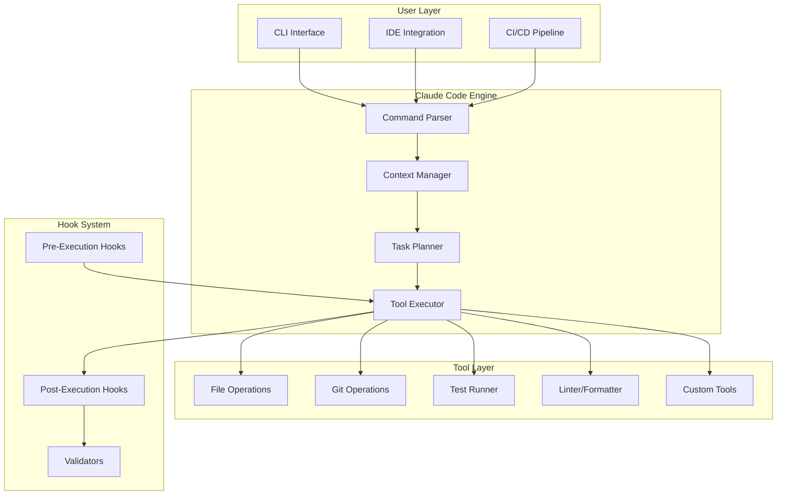

# The Complete Guide to Building Claude Code Agents: Best Practices & Node.js CLI Integration

## Table of Contents

1. [Executive Summary](#executive-summary)
2. [Core Principles for Agent Development](#core-principles)
3. [Claude Code Agent Architecture](#claude-code-agent-architecture)
4. [Node.js CLI Tool Integration Standards](#nodejs-cli-tool-integration-standards)
5. [Hook System & Automation](#hook-system--automation)
6. [The CLAUDE.md Configuration Bible](#the-claudemd-configuration-bible)
7. [Prompt Engineering for Agents](#prompt-engineering-for-agents)
8. [Tool Use & Function Calling Patterns](#tool-use--function-calling-patterns)
9. [Error Handling & Recovery Strategies](#error-handling--recovery-strategies)
10. [Multi-Agent Orchestration](#multi-agent-orchestration)
11. [Security & Permission Management](#security--permission-management)
12. [Performance Optimization](#performance-optimization)
13. [Testing & Validation](#testing--validation)
14. [Production Deployment](#production-deployment)
15. [Common Pitfalls & Solutions](#common-pitfalls--solutions)

## Executive Summary

Building effective Claude Code agents requires understanding three fundamental paradigms:

1. **Conversational Context Management** - Claude Code is not a batch processor but a conversational agent with persistent context
2. **Tool-First Development** - Agents are only as capable as the tools they can access
3. **Deterministic Control Flow** - Use hooks and structured outputs to create predictable, reliable behavior

This guide synthesizes research from [Anthropic's best practices](https://www.anthropic.com/engineering/claude-code-best-practices), [Node.js CLI standards](https://github.com/lirantal/nodejs-cli-apps-best-practices), and production deployment patterns to provide a comprehensive framework for agent development.

## Core Principles for Agent Development

### The Five Pillars of Agent Design

#### 1. **Single Responsibility Principle**

Each agent should have ONE clear purpose. Multi-purpose agents become unpredictable and hard to debug.

```bash
# Good: Focused agent
claude-code-test-runner     # Only runs tests
claude-code-doc-generator    # Only generates documentation
claude-code-pr-reviewer      # Only reviews PRs

# Bad: Kitchen sink agent
claude-code-do-everything    # Tries to handle all tasks
```

#### 2. **Explicit Over Implicit**

Always be explicit about agent capabilities, limitations, and expected behaviors.

```markdown
# CLAUDE.md - Good Example

## Agent Capabilities

- ✅ Can: Generate TypeScript/JavaScript code
- ✅ Can: Write unit tests using Jest
- ✅ Can: Create React components with hooks
- ❌ Cannot: Deploy to production
- ❌ Cannot: Access external APIs without approval
- ⚠️ Requires approval: Database schema changes
```

#### 3. **Fail Fast, Fail Gracefully**

Agents should detect problems early and provide actionable error messages.

```javascript
// Good: Clear error with context and recovery
if (!config.apiKey) {
  console.error(`
    ❌ Missing API key configuration
    
    To fix this:
    1. Create a .env file in your project root
    2. Add: ANTHROPIC_API_KEY=your_key_here
    3. Restart Claude Code
    
    See: https://docs.anthropic.com/setup
  `)
  process.exit(1)
}
```

#### 4. **Observability First**

Every agent action should be traceable, measurable, and debuggable.

```javascript
// Structured logging for agent actions
const logger = {
  action: (type, details) => {
    console.log(
      JSON.stringify({
        timestamp: new Date().toISOString(),
        agent: process.env.CLAUDE_AGENT_NAME,
        action: type,
        sessionId: process.env.CLAUDE_SESSION_ID,
        ...details,
      }),
    )
  },
}

logger.action('file_edit', {
  file: 'src/index.ts',
  lines_changed: 42,
  reason: 'Adding error handling',
})
```

#### 5. **Progressive Enhancement**

Start with simple capabilities and layer on complexity as needed.

```bash
# Evolution of an agent
v1: Basic file reading and writing
v2: + Git integration
v3: + Test running
v4: + Multi-file refactoring
v5: + Dependency management
```

## Claude Code Agent Architecture

### System Components



### Context Management Strategy

Based on research from [Anthropic's documentation](https://docs.anthropic.com/en/docs/claude-code/overview), effective context management is crucial:

```javascript
// Context hierarchy for optimal token usage
const contextLevels = {
  CRITICAL: {
    tokens: 4000,
    includes: ['current_file', 'immediate_imports', 'active_errors'],
    priority: 1,
  },
  IMPORTANT: {
    tokens: 8000,
    includes: ['related_interfaces', 'test_files', 'recent_changes'],
    priority: 2,
  },
  HELPFUL: {
    tokens: 16000,
    includes: ['usage_examples', 'documentation', 'similar_patterns'],
    priority: 3,
  },
  OPTIONAL: {
    tokens: 32000,
    includes: ['full_project_structure', 'dependencies', 'history'],
    priority: 4,
  },
}

// Dynamic context loading based on task
function loadContext(task, availableTokens) {
  let context = []
  let usedTokens = 0

  for (const [level, config] of Object.entries(contextLevels)) {
    if (usedTokens + config.tokens <= availableTokens) {
      context.push(...gatherContextForLevel(level, task))
      usedTokens += config.tokens
    }
  }

  return context
}
```

## Node.js CLI Tool Integration Standards

### Exit Codes and Error Handling

Following [Node.js best practices](https://github.com/lirantal/nodejs-cli-apps-best-practices), agents should use semantic exit codes:

```javascript
// Exit code constants with semantic meaning
const EXIT_CODES = {
  SUCCESS: 0,
  GENERAL_ERROR: 1,
  MISUSE_OF_SHELL_COMMAND: 2,
  PERMISSION_DENIED: 126,
  COMMAND_NOT_FOUND: 127,
  INVALID_EXIT_ARGUMENT: 128,

  // Custom application codes (128-255)
  CONFIG_ERROR: 129,
  NETWORK_ERROR: 130,
  AUTH_ERROR: 131,
  VALIDATION_ERROR: 132,
  TIMEOUT_ERROR: 133,
  RESOURCE_LIMIT: 134,
  DEPENDENCY_ERROR: 135,
}

// Usage in agent
class AgentError extends Error {
  constructor(message, code = EXIT_CODES.GENERAL_ERROR) {
    super(message)
    this.code = code
  }
}

// Graceful error handling
process.on('uncaughtException', (error) => {
  console.error({
    type: 'FATAL_ERROR',
    message: error.message,
    stack: error.stack,
    timestamp: new Date().toISOString(),
  })

  // Cleanup before exit
  cleanup()
  process.exit(error.code || EXIT_CODES.GENERAL_ERROR)
})
```

### Output Stream Management

Agents must properly use stdout, stderr, and structured output:

```javascript
// Output stream strategy
class AgentOutput {
  // Human-readable output to stdout
  info(message) {
    if (!this.isJsonMode()) {
      console.log(message)
    }
  }

  // Errors and warnings to stderr
  error(message) {
    console.error(this.format('ERROR', message))
  }

  warn(message) {
    console.error(this.format('WARNING', message))
  }

  // Machine-readable output for piping
  data(object) {
    if (this.isJsonMode()) {
      console.log(JSON.stringify(object))
    } else {
      console.log(util.inspect(object, { depth: null, colors: true }))
    }
  }

  // Progress indicators that don't interfere with output
  progress(message) {
    if (process.stderr.isTTY && !this.isJsonMode()) {
      process.stderr.write(`\r${message}`)
    }
  }

  isJsonMode() {
    return (
      process.env.CLAUDE_OUTPUT_FORMAT === 'json' ||
      process.argv.includes('--json')
    )
  }

  format(level, message) {
    if (this.isJsonMode()) {
      return JSON.stringify({ level, message, timestamp: Date.now() })
    }
    return `[${level}] ${message}`
  }
}
```

### Signal Handling

Proper POSIX signal handling for graceful shutdowns:

```javascript
class AgentLifecycle {
  constructor() {
    this.isShuttingDown = false
    this.activeOperations = new Set()

    // Register signal handlers
    process.on('SIGINT', () => this.shutdown('SIGINT'))
    process.on('SIGTERM', () => this.shutdown('SIGTERM'))
    process.on('SIGHUP', () => this.reload())
  }

  async shutdown(signal) {
    if (this.isShuttingDown) return
    this.isShuttingDown = true

    console.error(`\n${signal} received. Graceful shutdown initiated...`)

    // Cancel new operations
    this.acceptingNewWork = false

    // Wait for active operations with timeout
    const timeout = setTimeout(() => {
      console.error('Shutdown timeout exceeded. Forcing exit.')
      process.exit(EXIT_CODES.TIMEOUT_ERROR)
    }, 30000)

    try {
      await Promise.all(
        Array.from(this.activeOperations).map((op) => op.cancel()),
      )
      clearTimeout(timeout)

      // Cleanup resources
      await this.cleanup()

      console.error('Graceful shutdown complete')
      process.exit(EXIT_CODES.SUCCESS)
    } catch (error) {
      console.error('Error during shutdown:', error)
      process.exit(EXIT_CODES.GENERAL_ERROR)
    }
  }

  reload() {
    console.error('SIGHUP received. Reloading configuration...')
    // Reload configuration without stopping
    this.loadConfiguration()
  }
}
```

## Hook System & Automation

### Hook Architecture

Based on [Claude Code hooks documentation](https://docs.anthropic.com/en/docs/claude-code/hooks), here's a comprehensive hook system:

```json
{
  "$schema": "https://claude.ai/schemas/settings.json",
  "hooks": {
    "PreToolUse": [
      {
        "matcher": "Edit|Write|MultiEdit",
        "hooks": [
          {
            "type": "command",
            "command": "./hooks/pre-edit-validation.sh",
            "timeout": 30,
            "blocking": true
          }
        ]
      }
    ],
    "PostToolUse": [
      {
        "matcher": "Edit:*.ts|Edit:*.tsx",
        "hooks": [
          {
            "type": "command",
            "command": "npx tsc --noEmit --skipLibCheck",
            "timeout": 60
          },
          {
            "type": "command",
            "command": "npx eslint --fix ${CLAUDE_FILE_PATHS}",
            "timeout": 30
          }
        ]
      }
    ],
    "Stop": [
      {
        "matcher": "",
        "hooks": [
          {
            "type": "command",
            "command": "./hooks/session-summary.js",
            "input": "stdin"
          }
        ]
      }
    ]
  }
}
```

### Advanced Hook Patterns

#### 1. Validation Hook with JSON Control Flow

```javascript
#!/usr/bin/env node
// hooks/pre-edit-validation.js

const input = JSON.parse(process.env.CLAUDE_TOOL_INPUT || '{}')

async function validateEdit() {
  const { file, content } = input

  // Check file permissions
  if (file.includes('/production/') && !process.env.ALLOW_PROD_EDITS) {
    return {
      decision: 'block',
      reason: 'Production files cannot be edited without ALLOW_PROD_EDITS=true',
      suggestions: [
        'Set ALLOW_PROD_EDITS=true in your environment',
        'Or work on a development branch instead',
      ],
    }
  }

  // Validate content
  if (content.includes('TODO:') && process.env.BLOCK_TODOS === 'true') {
    return {
      decision: 'modify',
      reason: 'TODOs must be resolved before committing',
      modifiedContent: content.replace(/TODO:/g, 'FIXME:'),
    }
  }

  // Check for security issues
  const securityPatterns = [
    /api[_-]?key\s*=\s*["'][^"']+["']/gi,
    /password\s*=\s*["'][^"']+["']/gi,
    /token\s*=\s*["'][^"']+["']/gi,
  ]

  for (const pattern of securityPatterns) {
    if (pattern.test(content)) {
      return {
        decision: 'block',
        reason: 'Potential security issue: hardcoded credentials detected',
        fix: 'Use environment variables instead',
      }
    }
  }

  return { decision: 'allow' }
}

validateEdit().then((result) => {
  console.log(JSON.stringify(result))
  process.exit(result.decision === 'block' ? 1 : 0)
})
```

#### 2. Intelligent Context Management Hook

```bash
#!/bin/bash
# hooks/compact-context.sh

# Triggered when context is getting large
CONTEXT_SIZE=$(echo "$CLAUDE_SESSION_CONTEXT" | wc -c)
MAX_CONTEXT=100000

if [ $CONTEXT_SIZE -gt $MAX_CONTEXT ]; then
  echo "Context size ($CONTEXT_SIZE) exceeds limit. Compacting..."

  # Use Claude itself to summarize context
  claude -p "Summarize the key points from our conversation, focusing on:
    1. Current task and progress
    2. Decisions made
    3. Pending items
    Keep it under 500 words" \
    --output-format json > /tmp/context-summary.json

  # Clear and reinitialize with summary
  claude /clear
  claude -p "Continue from this summary: $(cat /tmp/context-summary.json)"
fi
```

#### 3. Automated Testing Hook

```javascript
#!/usr/bin/env node
// hooks/post-edit-test-runner.js

const { execSync } = require('child_process')
const path = require('path')

const modifiedFiles = process.env.CLAUDE_FILE_PATHS?.split(' ') || []

// Find and run relevant tests
for (const file of modifiedFiles) {
  const testFile = file
    .replace('/src/', '/__tests__/')
    .replace('.ts', '.test.ts')
    .replace('.tsx', '.test.tsx')

  if (fs.existsSync(testFile)) {
    try {
      console.log(`Running tests for ${file}...`)
      execSync(`npm test -- ${testFile} --coverage`, {
        stdio: 'inherit',
      })
    } catch (error) {
      // Test failed - provide feedback to Claude
      console.error(`Tests failed for ${file}`)

      // Generate fix suggestion
      const output = execSync(
        `claude -p "The tests for ${file} are failing. Analyze the error and suggest a fix" --json`,
        { encoding: 'utf8' },
      )

      console.log('Suggested fix:', output)
      process.exit(1)
    }
  }
}
```

## The CLAUDE.md Configuration Bible

### Complete CLAUDE.md Template

```markdown
# Project Configuration for Claude Code

## Project Overview

**Name**: MyAwesomeProject
**Type**: Full-stack TypeScript application
**Framework**: React (frontend), Express (backend)
**Database**: PostgreSQL with Prisma ORM
**Testing**: Jest, React Testing Library, Playwright

## Architecture

### Directory Structure
```

├── apps/
│ ├── frontend/ # React application
│ │ ├── src/
│ │ │ ├── components/ # Reusable UI components
│ │ │ ├── pages/ # Route pages
│ │ │ ├── hooks/ # Custom React hooks
│ │ │ ├── utils/ # Utility functions
│ │ │ └── api/ # API client code
│ │ └── tests/
│ └── backend/ # Express API
│ ├── src/
│ │ ├── routes/ # API routes
│ │ ├── services/ # Business logic
│ │ ├── models/ # Database models
│ │ └── middleware/ # Express middleware
│ └── tests/
├── packages/
│ ├── shared/ # Shared types and utilities
│ └── ui/ # UI component library
└── tools/ # Build and dev tools

````

## Development Standards

### Code Style
- **Language**: TypeScript with strict mode enabled
- **Style**: Prettier with 2-space indentation
- **Linting**: ESLint with recommended rules
- **Naming**:
  - Components: PascalCase (e.g., `UserProfile`)
  - Files: kebab-case (e.g., `user-profile.tsx`)
  - Functions: camelCase (e.g., `getUserData`)
  - Constants: UPPER_SNAKE_CASE (e.g., `MAX_RETRIES`)

### Git Workflow
- **Branching**: feature/*, bugfix/*, hotfix/*
- **Commits**: Conventional commits (feat:, fix:, docs:, etc.)
- **PR Process**: All changes require review before merge

### Testing Requirements
- **Unit Tests**: Required for all business logic
- **Integration Tests**: Required for API endpoints
- **Coverage**: Minimum 80% coverage required
- **E2E Tests**: Critical user paths only

## Claude Code Instructions

### Capabilities
✅ You can:
- Create and modify source files
- Write and run tests
- Refactor existing code
- Generate documentation
- Create git commits with descriptive messages
- Run build and lint commands

❌ You cannot:
- Deploy to production
- Modify database schemas without approval
- Delete files without explicit permission
- Install new dependencies without discussion
- Access external APIs without configuration

⚠️ Ask before:
- Making breaking changes
- Modifying configuration files
- Changing test fixtures
- Updating dependencies

### Workflow Preferences

1. **Before making changes**:
   - Read relevant existing code
   - Check for existing tests
   - Understand the current implementation

2. **When implementing features**:
   - Start with types/interfaces
   - Implement core logic
   - Add comprehensive tests
   - Update documentation

3. **Code Generation Rules**:
   - Always use TypeScript
   - Include JSDoc comments for public APIs
   - Add error handling for all async operations
   - Use functional components with hooks for React
   - Implement proper loading and error states

### Common Patterns

#### API Endpoint Pattern
```typescript
// Always follow this structure for new endpoints
router.post('/resource',
  authenticate,           // Authentication middleware
  validate(schema),       // Input validation
  async (req, res, next) => {
    try {
      const result = await service.method(req.body)
      res.json({ success: true, data: result })
    } catch (error) {
      next(error)  // Centralized error handling
    }
  }
)
````

#### React Component Pattern

```typescript
// Standard component structure
interface Props {
  // Define all props with JSDoc
}

export const Component: FC<Props> = ({ prop1, prop2 }) => {
  // Hooks at the top
  const [state, setState] = useState()

  // Event handlers
  const handleEvent = useCallback(() => {}, [])

  // Effects
  useEffect(() => {}, [])

  // Render
  return <div>{/* JSX */}</div>
}
```

### Error Messages Style

When encountering errors, provide:

1. What went wrong (clear description)
2. Why it went wrong (root cause)
3. How to fix it (actionable steps)

Example:

```
❌ Database connection failed

Cause: PostgreSQL is not running on port 5432

To fix:
1. Start PostgreSQL: `brew services start postgresql`
2. Verify it's running: `pg_isready`
3. Retry the operation
```

## Project-Specific Context

### Current Sprint Goals

- [ ] Implement user authentication
- [ ] Add data export functionality
- [ ] Improve test coverage to 85%

### Known Issues

- Performance degradation with >1000 items (see #234)
- Flaky test in user.service.test.ts (intermittent)

### Environment Variables

Required variables (see .env.example):

- DATABASE_URL: PostgreSQL connection string
- JWT_SECRET: Authentication secret
- API_BASE_URL: Backend API URL
- REDIS_URL: Cache connection (optional)

### External Services

- Auth: Auth0 (configuration in auth.config.ts)
- Storage: AWS S3 (credentials in AWS_PROFILE)
- Email: SendGrid (API key required)

## Debug Information

### Common Commands

```bash
# Development
npm run dev           # Start all services
npm run dev:frontend  # Frontend only
npm run dev:backend   # Backend only

# Testing
npm test             # Run all tests
npm run test:watch   # Watch mode
npm run test:e2e     # E2E tests

# Building
npm run build        # Build all
npm run typecheck    # Type checking
npm run lint         # Linting
```

### Troubleshooting

#### Issue: TypeScript errors after git pull

Solution: Run `npm run clean && npm install`

#### Issue: Database connection errors

Solution: Check DATABASE_URL and run `npm run db:migrate`

#### Issue: Tests failing locally but not in CI

Solution: Reset test database with `npm run db:test:reset`

````

## Prompt Engineering for Agents

### The RIPEMD Framework (Role, Instructions, Patterns, Examples, Metadata, Delimiters)

Based on research from [prompt engineering best practices](https://platform.openai.com/docs/guides/prompt-engineering), structure agent prompts systematically:

```typescript
interface AgentPrompt {
  role: string
  instructions: string[]
  patterns: Pattern[]
  examples: Example[]
  metadata: Metadata
  delimiters: Delimiters
}

class PromptBuilder {
  build(config: AgentPrompt): string {
    return `
# Role
${config.role}

# Instructions
${config.instructions.map((i, idx) => `${idx + 1}. ${i}`).join('\n')}

# Patterns to Follow
${config.patterns.map(p => this.formatPattern(p)).join('\n\n')}

# Examples
${config.examples.map(e => this.formatExample(e)).join('\n\n')}

# Metadata
${JSON.stringify(config.metadata, null, 2)}

# Task
<task>
{{USER_INPUT}}
</task>

# Output Format
<output>
{{EXPECTED_FORMAT}}
</output>
    `.trim()
  }

  formatPattern(pattern: Pattern): string {
    return `
## ${pattern.name}
**When**: ${pattern.condition}
**Do**: ${pattern.action}
**Example**: \`${pattern.example}\`
    `.trim()
  }

  formatExample(example: Example): string {
    return `
### ${example.scenario}
**Input**: ${example.input}
**Output**: ${example.output}
**Explanation**: ${example.reasoning}
    `.trim()
  }
}
````

### Agent Persistence Instructions

Following [OpenAI's agent guidelines](https://platform.openai.com/docs/guides/prompt-engineering), include these three critical instructions:

```markdown
## PERSISTENCE

You are an autonomous agent. Continue working until the task is completely resolved before yielding control back to the user. Only stop when you are certain the problem is solved or need user input.

## TOOL CALLING

Never guess or make assumptions. Always use your tools to:

- Read files before making changes
- Verify current state before actions
- Test changes after implementation
- Gather context when uncertain

## PLANNING

Before each action:

1. Analyze the current situation
2. Plan your approach (share this with the user)
3. Execute step by step
4. Reflect on results
5. Adjust plan if needed

Do not rush. Think thoroughly before acting.
```

## Tool Use & Function Calling Patterns

### Structured Output with Tool Definitions

Based on [function calling best practices](https://platform.openai.com/docs/guides/function-calling), define tools with strict schemas:

```typescript
interface ToolDefinition {
  name: string
  description: string
  parameters: JSONSchema
  returns: JSONSchema
  examples: ToolExample[]
  errorHandling: ErrorStrategy
}

// Example tool definition
const fileOperationTool: ToolDefinition = {
  name: 'file_operation',
  description: 'Perform file system operations (read, write, delete)',
  parameters: {
    type: 'object',
    properties: {
      operation: {
        type: 'string',
        enum: ['read', 'write', 'append', 'delete', 'move', 'copy'],
        description: 'The operation to perform',
      },
      path: {
        type: 'string',
        pattern: '^[^/].*$', // Prevent absolute paths
        description: 'Relative path to the file',
      },
      content: {
        type: 'string',
        description: 'Content for write/append operations',
      },
      encoding: {
        type: 'string',
        enum: ['utf8', 'base64', 'hex'],
        default: 'utf8',
      },
    },
    required: ['operation', 'path'],
    additionalProperties: false,
  },
  returns: {
    type: 'object',
    properties: {
      success: { type: 'boolean' },
      data: { type: 'string' },
      error: { type: 'string' },
    },
  },
  examples: [
    {
      input: { operation: 'read', path: 'src/index.ts' },
      output: { success: true, data: '// file contents...' },
    },
  ],
  errorHandling: {
    retry: true,
    maxRetries: 3,
    fallback: 'return_error',
  },
}
```

### Tool Orchestration Patterns

#### 1. Sequential Tool Chain

```typescript
class ToolChain {
  async execute(steps: ToolStep[]): Promise<ChainResult> {
    const results = []
    let context = {}

    for (const step of steps) {
      try {
        const input = this.prepareInput(step, context)
        const result = await this.callTool(step.tool, input)

        results.push({
          step: step.name,
          success: true,
          output: result,
        })

        // Pass results to next step
        context = { ...context, [step.name]: result }
      } catch (error) {
        if (step.required) {
          throw new ChainError(`Required step ${step.name} failed`, error)
        }

        results.push({
          step: step.name,
          success: false,
          error: error.message,
        })
      }
    }

    return { results, context }
  }
}
```

#### 2. Parallel Tool Execution

```typescript
class ParallelToolExecutor {
  async executeParallel(
    tools: ToolCall[],
    options: ParallelOptions = {},
  ): Promise<ToolResults> {
    const { maxConcurrency = 5, timeout = 30000 } = options

    // Create semaphore for concurrency control
    const semaphore = new Semaphore(maxConcurrency)

    const promises = tools.map(async (tool) => {
      await semaphore.acquire()

      try {
        const result = await Promise.race([
          this.executeTool(tool),
          this.timeout(timeout, tool.name),
        ])

        return { tool: tool.name, success: true, result }
      } catch (error) {
        return { tool: tool.name, success: false, error }
      } finally {
        semaphore.release()
      }
    })

    return Promise.all(promises)
  }

  private timeout(ms: number, toolName: string): Promise<never> {
    return new Promise((_, reject) => {
      setTimeout(() => {
        reject(new Error(`Tool ${toolName} timed out after ${ms}ms`))
      }, ms)
    })
  }
}
```

#### 3. Conditional Tool Routing

```typescript
class ConditionalRouter {
  routes: Map<string, ToolRoute> = new Map()

  addRoute(condition: string, tool: Tool, fallback?: Tool) {
    this.routes.set(condition, { tool, fallback })
  }

  async route(context: Context): Promise<any> {
    for (const [condition, route] of this.routes) {
      if (await this.evaluateCondition(condition, context)) {
        try {
          return await route.tool.execute(context)
        } catch (error) {
          if (route.fallback) {
            console.warn(`Primary tool failed, using fallback: ${error}`)
            return await route.fallback.execute(context)
          }
          throw error
        }
      }
    }

    throw new Error('No matching route found')
  }
}
```

## Error Handling & Recovery Strategies

### Comprehensive Error Taxonomy

```typescript
enum ErrorCategory {
  // Recoverable errors
  NETWORK = 'NETWORK', // Retry with backoff
  RATE_LIMIT = 'RATE_LIMIT', // Wait and retry
  TIMEOUT = 'TIMEOUT', // Increase timeout or chunk work
  VALIDATION = 'VALIDATION', // Fix input and retry

  // Semi-recoverable errors
  AUTH = 'AUTH', // Refresh token or re-authenticate
  PERMISSION = 'PERMISSION', // Request permission or use fallback
  RESOURCE = 'RESOURCE', // Wait for resource or use alternative

  // Non-recoverable errors
  SYNTAX = 'SYNTAX', // Fix code and restart
  CONFIG = 'CONFIG', // Fix configuration and restart
  CORRUPT = 'CORRUPT', // Manual intervention required
  FATAL = 'FATAL', // Shutdown required
}

class ErrorHandler {
  private strategies = new Map<ErrorCategory, ErrorStrategy>()

  constructor() {
    this.registerStrategies()
  }

  private registerStrategies() {
    // Network errors: exponential backoff
    this.strategies.set(ErrorCategory.NETWORK, {
      async handle(error, context) {
        const delay = Math.min(1000 * Math.pow(2, context.attempt), 30000)
        await sleep(delay)
        return { action: 'retry', delay }
      },
    })

    // Rate limit: respect retry-after header
    this.strategies.set(ErrorCategory.RATE_LIMIT, {
      async handle(error, context) {
        const retryAfter = error.headers?.['retry-after'] || 60
        await sleep(retryAfter * 1000)
        return { action: 'retry', delay: retryAfter }
      },
    })

    // Validation: attempt to fix
    this.strategies.set(ErrorCategory.VALIDATION, {
      async handle(error, context) {
        const fixed = await this.attemptAutoFix(error, context)
        if (fixed) {
          return { action: 'retry', input: fixed }
        }
        return { action: 'fail', reason: 'Cannot auto-fix validation' }
      },
    })
  }

  async handle(error: AgentError): Promise<ErrorResolution> {
    const category = this.categorize(error)
    const strategy = this.strategies.get(category)

    if (!strategy) {
      return { action: 'fail', reason: 'No strategy for error type' }
    }

    const context = this.buildContext(error)
    return strategy.handle(error, context)
  }
}
```

### Recovery Patterns

#### 1. Circuit Breaker Pattern

```typescript
class CircuitBreaker {
  private state: 'CLOSED' | 'OPEN' | 'HALF_OPEN' = 'CLOSED'
  private failures = 0
  private successfulCalls = 0
  private nextAttempt = Date.now()

  constructor(
    private threshold = 5,
    private timeout = 60000,
    private halfOpenCalls = 3,
  ) {}

  async call<T>(fn: () => Promise<T>): Promise<T> {
    if (this.state === 'OPEN') {
      if (Date.now() < this.nextAttempt) {
        throw new Error('Circuit breaker is OPEN')
      }
      this.state = 'HALF_OPEN'
      this.successfulCalls = 0
    }

    try {
      const result = await fn()
      this.onSuccess()
      return result
    } catch (error) {
      this.onFailure()
      throw error
    }
  }

  private onSuccess() {
    this.failures = 0

    if (this.state === 'HALF_OPEN') {
      this.successfulCalls++
      if (this.successfulCalls >= this.halfOpenCalls) {
        this.state = 'CLOSED'
      }
    }
  }

  private onFailure() {
    this.failures++

    if (this.failures >= this.threshold) {
      this.state = 'OPEN'
      this.nextAttempt = Date.now() + this.timeout
    }
  }
}
```

#### 2. Bulkhead Pattern

```typescript
class Bulkhead {
  private queues = new Map<string, Queue>()

  constructor(private limits: Map<string, number>) {}

  async execute<T>(partition: string, fn: () => Promise<T>): Promise<T> {
    const limit = this.limits.get(partition) || 10

    if (!this.queues.has(partition)) {
      this.queues.set(partition, new Queue(limit))
    }

    const queue = this.queues.get(partition)!
    return queue.add(fn)
  }
}
```

## Multi-Agent Orchestration

### Sub-Agent Architecture

Based on research from [multi-agent patterns](https://www.tinybird.co/blog-posts/multi-agent-claude-code-tinybird-code), implement specialized sub-agents:

```typescript
interface SubAgent {
  name: string
  capabilities: string[]
  constraints: string[]
  tools: Tool[]
  context: string
}

class AgentOrchestrator {
  private agents = new Map<string, SubAgent>()
  private messageQueue = new Queue()

  registerAgent(agent: SubAgent) {
    this.agents.set(agent.name, agent)
  }

  async delegate(task: Task): Promise<TaskResult> {
    // Determine best agent for task
    const agent = this.selectAgent(task)

    // Create isolated context
    const context = this.createContext(agent, task)

    // Execute with monitoring
    const monitor = new TaskMonitor(task.id)

    try {
      const result = await this.executeWithAgent(agent, task, context)
      monitor.success(result)
      return result
    } catch (error) {
      monitor.failure(error)

      // Try fallback agent
      const fallback = this.selectFallback(agent, task)
      if (fallback) {
        return this.delegate({ ...task, agent: fallback.name })
      }

      throw error
    }
  }

  private selectAgent(task: Task): SubAgent {
    // Score each agent based on capability match
    const scores = new Map<string, number>()

    for (const [name, agent] of this.agents) {
      let score = 0

      // Check capability match
      for (const required of task.requirements) {
        if (agent.capabilities.includes(required)) {
          score += 10
        }
      }

      // Check constraints
      for (const constraint of task.constraints) {
        if (!agent.constraints.includes(constraint)) {
          score += 5
        }
      }

      // Tool availability
      for (const tool of task.tools) {
        if (agent.tools.some((t) => t.name === tool)) {
          score += 3
        }
      }

      scores.set(name, score)
    }

    // Select highest scoring agent
    const [bestAgent] = Array.from(scores.entries()).sort(
      ([, a], [, b]) => b - a,
    )[0]

    return this.agents.get(bestAgent)!
  }
}
```

### Agent Communication Patterns

#### 1. Message Passing

```typescript
class AgentMessageBus {
  private subscribers = new Map<string, Set<MessageHandler>>()

  subscribe(topic: string, handler: MessageHandler) {
    if (!this.subscribers.has(topic)) {
      this.subscribers.set(topic, new Set())
    }
    this.subscribers.get(topic)!.add(handler)
  }

  async publish(message: AgentMessage): Promise<void> {
    const handlers = this.subscribers.get(message.topic) || new Set()

    const promises = Array.from(handlers).map((handler) =>
      this.invokeHandler(handler, message),
    )

    await Promise.all(promises)
  }

  private async invokeHandler(
    handler: MessageHandler,
    message: AgentMessage,
  ): Promise<void> {
    try {
      await handler(message)
    } catch (error) {
      console.error(`Handler failed for ${message.topic}:`, error)
      // Don't let one handler failure affect others
    }
  }
}
```

#### 2. Shared Context

```typescript
class SharedContext {
  private data = new Map<string, any>()
  private locks = new Map<string, Lock>()
  private versions = new Map<string, number>()

  async read(key: string): Promise<any> {
    return this.data.get(key)
  }

  async write(key: string, value: any): Promise<void> {
    const lock = await this.acquireLock(key)

    try {
      const version = this.versions.get(key) || 0
      this.data.set(key, value)
      this.versions.set(key, version + 1)

      // Notify watchers
      this.notifyChange(key, value, version + 1)
    } finally {
      lock.release()
    }
  }

  async transaction<T>(
    keys: string[],
    fn: (tx: Transaction) => Promise<T>,
  ): Promise<T> {
    const locks = await Promise.all(keys.map((key) => this.acquireLock(key)))

    try {
      const tx = new Transaction(this, keys)
      const result = await fn(tx)
      await tx.commit()
      return result
    } catch (error) {
      await tx.rollback()
      throw error
    } finally {
      locks.forEach((lock) => lock.release())
    }
  }
}
```

## Security & Permission Management

### Permission Model

Based on [Claude Code security documentation](https://docs.anthropic.com/en/docs/claude-code/settings), implement granular permissions:

```typescript
interface PermissionPolicy {
  defaultMode: 'ask' | 'allow' | 'deny'
  rules: PermissionRule[]
  overrides: Map<string, Permission>
}

interface PermissionRule {
  pattern: string | RegExp
  actions: Action[]
  decision: 'allow' | 'deny' | 'ask'
  conditions?: Condition[]
}

class PermissionManager {
  private policy: PermissionPolicy

  async checkPermission(
    action: Action,
    resource: Resource,
  ): Promise<PermissionDecision> {
    // Check overrides first
    const override = this.policy.overrides.get(resource.id)
    if (override) {
      return override.decision
    }

    // Check rules
    for (const rule of this.policy.rules) {
      if (this.matchesRule(rule, action, resource)) {
        if (rule.conditions) {
          const conditionsMet = await this.evaluateConditions(rule.conditions, {
            action,
            resource,
          })

          if (!conditionsMet) continue
        }

        return rule.decision
      }
    }

    // Fall back to default
    return this.policy.defaultMode
  }

  private matchesRule(
    rule: PermissionRule,
    action: Action,
    resource: Resource,
  ): boolean {
    const patternMatch =
      typeof rule.pattern === 'string'
        ? minimatch(resource.path, rule.pattern)
        : rule.pattern.test(resource.path)

    const actionMatch =
      rule.actions.includes(action) || rule.actions.includes('*')

    return patternMatch && actionMatch
  }
}
```

### Sandboxing Strategies

```typescript
class Sandbox {
  private vm: VM
  private fs: VirtualFileSystem
  private network: NetworkProxy

  constructor(private config: SandboxConfig) {
    this.vm = new VM({
      timeout: config.timeout || 30000,
      sandbox: this.createSandbox(),
    })

    this.fs = new VirtualFileSystem(config.fsRoot)
    this.network = new NetworkProxy(config.allowedHosts)
  }

  private createSandbox(): any {
    return {
      // Safe globals
      console: this.createSafeConsole(),
      setTimeout: this.createSafeTimer(),

      // Restricted APIs
      fs: this.fs.api,
      http: this.network.api,

      // Completely blocked
      process: undefined,
      require: this.createSafeRequire(),
      eval: undefined,
      Function: undefined,
    }
  }

  async execute(code: string): Promise<any> {
    // Validate code first
    const validation = await this.validateCode(code)
    if (!validation.safe) {
      throw new SecurityError(validation.reason)
    }

    // Execute in sandbox
    try {
      return await this.vm.run(code)
    } catch (error) {
      // Sanitize error before rethrowing
      throw this.sanitizeError(error)
    }
  }
}
```

## Performance Optimization

### Token Management

```typescript
class TokenOptimizer {
  private cache = new LRUCache<string, any>(100)

  async optimizeContext(
    context: Context,
    maxTokens: number,
  ): Promise<OptimizedContext> {
    // Measure current token usage
    const currentTokens = this.countTokens(context)

    if (currentTokens <= maxTokens) {
      return context
    }

    // Progressive reduction strategies
    const strategies = [
      this.removeComments,
      this.truncateLongStrings,
      this.summarizeRepetitive,
      this.dropOptionalContext,
      this.compressWithCache,
    ]

    let optimized = context
    for (const strategy of strategies) {
      optimized = await strategy.call(this, optimized)

      if (this.countTokens(optimized) <= maxTokens) {
        break
      }
    }

    return optimized
  }

  private removeComments(context: Context): Context {
    // Remove comments from code while preserving JSDoc
    return {
      ...context,
      code: context.code.map((file) => ({
        ...file,
        content: file.content.replace(
          /\/\/(?![\/\*]).*$|\/\*(?![\*\!])[\s\S]*?\*\//gm,
          '',
        ),
      })),
    }
  }

  private async summarizeRepetitive(context: Context): Promise<Context> {
    // Use Claude to summarize repetitive patterns
    const patterns = this.findRepetitivePatterns(context)

    if (patterns.length === 0) return context

    const summary = await this.claude.summarize(patterns)

    return {
      ...context,
      patterns: summary,
    }
  }
}
```

### Caching Strategies

```typescript
class AgentCache {
  private memory = new Map<string, CacheEntry>()
  private persistent = new PersistentCache('./cache')

  async get<T>(
    key: string,
    generator: () => Promise<T>,
    options: CacheOptions = {},
  ): Promise<T> {
    // Check memory cache
    const memoryEntry = this.memory.get(key)
    if (memoryEntry && !this.isExpired(memoryEntry)) {
      return memoryEntry.value as T
    }

    // Check persistent cache
    const persistentEntry = await this.persistent.get(key)
    if (persistentEntry && !this.isExpired(persistentEntry)) {
      // Promote to memory
      this.memory.set(key, persistentEntry)
      return persistentEntry.value as T
    }

    // Generate fresh value
    const value = await generator()

    // Cache based on options
    const entry: CacheEntry = {
      value,
      timestamp: Date.now(),
      ttl: options.ttl || 3600000,
      hits: 0,
    }

    this.memory.set(key, entry)

    if (options.persistent) {
      await this.persistent.set(key, entry)
    }

    return value
  }

  private isExpired(entry: CacheEntry): boolean {
    return Date.now() - entry.timestamp > entry.ttl
  }
}
```

## Testing & Validation

### Agent Testing Framework

```typescript
class AgentTestFramework {
  private scenarios = new Map<string, TestScenario>()

  scenario(name: string, setup: ScenarioSetup): this {
    this.scenarios.set(name, {
      name,
      setup,
      assertions: [],
      cleanup: null,
    })
    return this
  }

  async runScenario(name: string): Promise<TestResult> {
    const scenario = this.scenarios.get(name)
    if (!scenario) {
      throw new Error(`Scenario ${name} not found`)
    }

    const context = await scenario.setup()
    const results: AssertionResult[] = []

    try {
      // Run agent
      const agent = new Agent(context.config)
      const output = await agent.execute(context.input)

      // Run assertions
      for (const assertion of scenario.assertions) {
        const result = await assertion(output, context)
        results.push(result)
      }

      return {
        scenario: name,
        passed: results.every((r) => r.passed),
        results,
      }
    } finally {
      if (scenario.cleanup) {
        await scenario.cleanup(context)
      }
    }
  }
}

// Example test
const tester = new AgentTestFramework()

tester
  .scenario('code-generation', async () => ({
    config: { model: 'claude-3-sonnet' },
    input: 'Create a TypeScript function to validate email',
    expected: {
      hasTypeAnnotations: true,
      hasTests: true,
      hasDocumentation: true,
    },
  }))
  .assert('generates valid TypeScript', async (output) => {
    const { diagnostics } = ts.transpileModule(output.code, {
      compilerOptions: { strict: true },
    })
    return diagnostics.length === 0
  })
  .assert('includes comprehensive tests', async (output) => {
    const testCount = (output.tests.match(/it\(/g) || []).length
    return testCount >= 5
  })
```

### Validation Pipelines

```typescript
class ValidationPipeline {
  private validators: Validator[] = []

  add(validator: Validator): this {
    this.validators.push(validator)
    return this
  }

  async validate(input: any): Promise<ValidationResult> {
    const errors: ValidationError[] = []
    const warnings: ValidationWarning[] = []

    for (const validator of this.validators) {
      const result = await validator.validate(input)

      if (result.errors) {
        errors.push(...result.errors)

        if (validator.blocking && errors.length > 0) {
          break // Stop on first blocking error
        }
      }

      if (result.warnings) {
        warnings.push(...result.warnings)
      }
    }

    return {
      valid: errors.length === 0,
      errors,
      warnings,
    }
  }
}

// Example validators
const syntaxValidator: Validator = {
  name: 'syntax',
  blocking: true,
  async validate(code: string) {
    try {
      esprima.parseScript(code)
      return { valid: true }
    } catch (error) {
      return {
        valid: false,
        errors: [
          {
            type: 'syntax',
            message: error.message,
            line: error.lineNumber,
          },
        ],
      }
    }
  },
}

const securityValidator: Validator = {
  name: 'security',
  blocking: false,
  async validate(code: string) {
    const issues = []

    // Check for dangerous patterns
    const dangerous = [
      /eval\s*\(/,
      /new\s+Function\s*\(/,
      /child_process/,
      /\.exec\s*\(/,
    ]

    for (const pattern of dangerous) {
      if (pattern.test(code)) {
        issues.push({
          type: 'security',
          severity: 'high',
          pattern: pattern.source,
        })
      }
    }

    return {
      valid: issues.length === 0,
      warnings: issues,
    }
  },
}
```

## Production Deployment

### Deployment Checklist

```typescript
interface DeploymentChecklist {
  preDeployment: ChecklistItem[]
  deployment: ChecklistItem[]
  postDeployment: ChecklistItem[]
  rollback: ChecklistItem[]
}

const productionChecklist: DeploymentChecklist = {
  preDeployment: [
    {
      task: 'Run full test suite',
      command: 'npm run test:all',
      required: true,
      automated: true,
    },
    {
      task: 'Security audit',
      command: 'npm audit --production',
      required: true,
      automated: true,
    },
    {
      task: 'Performance benchmarks',
      command: 'npm run benchmark',
      required: false,
      automated: true,
    },
    {
      task: 'Documentation review',
      command: null,
      required: true,
      automated: false,
    },
  ],

  deployment: [
    {
      task: 'Build production artifacts',
      command: 'npm run build:prod',
      required: true,
      automated: true,
    },
    {
      task: 'Database migrations',
      command: 'npm run migrate:prod',
      required: true,
      automated: false, // Requires confirmation
    },
    {
      task: 'Deploy to staging',
      command: 'npm run deploy:staging',
      required: true,
      automated: true,
    },
    {
      task: 'Smoke tests on staging',
      command: 'npm run test:smoke:staging',
      required: true,
      automated: true,
    },
    {
      task: 'Deploy to production',
      command: 'npm run deploy:prod',
      required: true,
      automated: false, // Requires manual approval
    },
  ],

  postDeployment: [
    {
      task: 'Health checks',
      command: 'npm run health:check',
      required: true,
      automated: true,
    },
    {
      task: 'Monitor error rates',
      command: null,
      required: true,
      automated: false,
      duration: '30 minutes',
    },
    {
      task: 'Performance monitoring',
      command: null,
      required: true,
      automated: false,
      duration: '1 hour',
    },
  ],

  rollback: [
    {
      task: 'Revert deployment',
      command: 'npm run deploy:rollback',
      required: true,
      automated: false,
    },
    {
      task: 'Restore database',
      command: 'npm run db:restore',
      required: false,
      automated: false,
    },
    {
      task: 'Clear caches',
      command: 'npm run cache:clear',
      required: true,
      automated: true,
    },
    {
      task: 'Notify team',
      command: null,
      required: true,
      automated: false,
    },
  ],
}
```

### Monitoring & Observability

```typescript
class AgentMonitor {
  private metrics = new MetricsCollector()
  private tracer = new Tracer()

  instrument(agent: Agent): Agent {
    return new Proxy(agent, {
      get: (target, prop) => {
        const original = target[prop]

        if (typeof original === 'function') {
          return this.wrapMethod(target, prop as string, original)
        }

        return original
      },
    })
  }

  private wrapMethod(target: any, method: string, original: Function) {
    return async (...args: any[]) => {
      const span = this.tracer.startSpan(`agent.${method}`)
      const timer = this.metrics.timer(`agent.${method}.duration`)

      try {
        const result = await original.apply(target, args)

        this.metrics.increment(`agent.${method}.success`)
        span.setTag('status', 'success')

        return result
      } catch (error) {
        this.metrics.increment(`agent.${method}.error`)
        span.setTag('status', 'error')
        span.setTag('error', error.message)

        throw error
      } finally {
        timer.end()
        span.finish()
      }
    }
  }
}
```

## Common Pitfalls & Solutions

### Pitfall 1: Context Explosion

**Problem**: Agent context grows unbounded, hitting token limits

**Solution**: Implement sliding window context management

```typescript
class SlidingWindowContext {
  private window: ContextItem[] = []

  constructor(
    private maxSize: number,
    private prioritizer: Prioritizer,
  ) {}

  add(item: ContextItem) {
    this.window.push(item)

    if (this.window.length > this.maxSize) {
      // Remove lowest priority items
      this.window = this.prioritizer.sort(this.window).slice(0, this.maxSize)
    }
  }
}
```

### Pitfall 2: Tool Call Loops

**Problem**: Agent gets stuck calling the same tool repeatedly

**Solution**: Implement loop detection and breaking

```typescript
class LoopDetector {
  private history: string[] = []
  private patterns = new Map<string, number>()

  detectLoop(action: string): boolean {
    this.history.push(action)

    // Check for immediate repetition
    const recent = this.history.slice(-5)
    if (recent.every((a) => a === action)) {
      return true
    }

    // Check for pattern repetition
    const pattern = this.history.slice(-10).join(',')
    const count = (this.patterns.get(pattern) || 0) + 1
    this.patterns.set(pattern, count)

    return count > 3
  }

  reset() {
    this.history = []
    this.patterns.clear()
  }
}
```

### Pitfall 3: Permission Escalation

**Problem**: Agent gains unintended permissions through tool chaining

**Solution**: Implement permission boundaries

```typescript
class PermissionBoundary {
  private maxEscalation = 2
  private currentLevel = 0

  async execute<T>(level: number, fn: () => Promise<T>): Promise<T> {
    if (level > this.currentLevel + this.maxEscalation) {
      throw new PermissionError(
        `Cannot escalate from level ${this.currentLevel} to ${level}`,
      )
    }

    const previousLevel = this.currentLevel
    this.currentLevel = level

    try {
      return await fn()
    } finally {
      this.currentLevel = previousLevel
    }
  }
}
```

### Pitfall 4: Inconsistent State

**Problem**: Multiple agents modifying shared state cause conflicts

**Solution**: Implement optimistic concurrency control

```typescript
class OptimisticLock {
  private versions = new Map<string, number>()

  async update<T>(key: string, updater: (current: T) => T): Promise<T> {
    const maxRetries = 3

    for (let i = 0; i < maxRetries; i++) {
      const current = await this.read(key)
      const version = this.versions.get(key) || 0

      const updated = updater(current)

      if (await this.compareAndSwap(key, updated, version)) {
        return updated
      }

      // Conflict detected, retry with exponential backoff
      await sleep(100 * Math.pow(2, i))
    }

    throw new ConcurrencyError(
      `Failed to update ${key} after ${maxRetries} attempts`,
    )
  }
}
```

## Conclusion

Building effective Claude Code agents requires a systematic approach combining:

1. **Clear Architecture**: Single-responsibility agents with well-defined boundaries
2. **Robust Error Handling**: Comprehensive error taxonomy and recovery strategies
3. **Security First**: Granular permissions and sandboxing
4. **Performance Optimization**: Token management and caching
5. **Production Readiness**: Monitoring, testing, and deployment automation

The key to success is starting simple and progressively adding complexity as needed. Focus on creating deterministic, observable, and testable agents that enhance rather than replace human judgment.

Remember: **Agents are tools, not magic**. They excel at automating repetitive tasks and augmenting human capabilities, but require careful design, testing, and monitoring to be truly effective.

## Resources & References

### Official Documentation

- [Claude Code Documentation](https://docs.anthropic.com/en/docs/claude-code/overview)
- [Claude Code Best Practices](https://www.anthropic.com/engineering/claude-code-best-practices)
- [Claude Code CLI Reference](https://docs.anthropic.com/en/docs/claude-code/cli-reference)
- [Claude Code Hooks Documentation](https://docs.anthropic.com/en/docs/claude-code/hooks)
- [Model Context Protocol (MCP)](https://modelcontextprotocol.io/)

### Node.js CLI Development

- [Node.js CLI Best Practices](https://github.com/lirantal/nodejs-cli-apps-best-practices)
- [Commander.js Documentation](https://github.com/tj/commander.js)
- [Node.js Error Codes](https://nodejs.org/api/errors.html)
- [Console API Documentation](https://nodejs.org/api/console.html)

### AI Agent Development

- [Building Effective AI Agents - Anthropic](https://www.anthropic.com/research/building-effective-agents)
- [OpenAI Function Calling Guide](https://platform.openai.com/docs/guides/function-calling)
- [Prompt Engineering Best Practices](https://platform.openai.com/docs/guides/prompt-engineering)

### Community Resources

- [Awesome Claude Code](https://github.com/hesreallyhim/awesome-claude-code)
- [Claude Code Hooks Mastery](https://github.com/disler/claude-code-hooks-mastery)
- [ClaudeLog - Community Guides](https://www.claudelog.com/)

## Appendix A: Complete Hook Examples

### A1. Comprehensive Pre-Commit Hook

```bash
#!/usr/bin/env node
// .claude/hooks/pre-commit.js

const { execSync } = require('child_process')
const fs = require('fs')
const path = require('path')

class PreCommitValidator {
  constructor() {
    this.errors = []
    this.warnings = []
    this.stagedFiles = this.getStagedFiles()
  }

  getStagedFiles() {
    const output = execSync('git diff --cached --name-only', { encoding: 'utf8' })
    return output.split('\n').filter(Boolean)
  }

  async validate() {
    console.log('🔍 Running pre-commit validation...\n')

    // Run all validators
    await Promise.all([
      this.validateNoSecrets(),
      this.validateNoDebugCode(),
      this.validateTests(),
      this.validateTypes(),
      this.validateLinting(),
      this.validateDocumentation()
    ])

    // Report results
    this.report()

    // Exit with appropriate code
    if (this.errors.length > 0) {
      process.exit(1)
    }
  }

  async validateNoSecrets() {
    const secretPatterns = [
      /(?:api[_-]?key|apikey|secret|password|pwd|token|auth)[\s]*[:=][\s]*["'][^"']{8,}/gi,
      /(?:AKIA|ASIA)[A-Z0-9]{16}/g, // AWS keys
      /ghp_[a-zA-Z0-9]{36}/g, // GitHub tokens
      /sk-[a-zA-Z0-9]{48}/g, // OpenAI keys
      /-----BEGIN (?:RSA |EC )?PRIVATE KEY-----/g
    ]

    for (const file of this.stagedFiles) {
      if (file.endsWith('.env') || file.includes('test')) continue

      try {
        const content = fs.readFileSync(file, 'utf8')

        for (const pattern of secretPatterns) {
          if (pattern.test(content)) {
            this.errors.push({
              file,
              type: 'SECURITY',
              message: 'Potential secret/credential detected',
              fix: 'Remove hardcoded secrets and use environment variables'
            })
            break
          }
        }
      } catch (error) {
        // File might be deleted
      }
    }
  }

  async validateNoDebugCode() {
    const debugPatterns = [
      /console\.(log|debug|trace)/g,
      /debugger/g,
      /\.only\(/g, // Exclusive tests
      /\.skip\(/g, // Skipped tests
      /TODO:/gi,
      /FIXME:/gi,
      /XXX:/gi,
      /HACK:/gi
    ]

    const jsFiles = this.stagedFiles.filter(f =>
      /\.(js|jsx|ts|tsx)$/.test(f) && !f.includes('test')
    )

    for (const file of jsFiles) {
      try {
        const content = fs.readFileSync(file, 'utf8')
        const lines = content.split('\n')

        lines.forEach((line, idx) => {
          for (const pattern of debugPatterns) {
            if (pattern.test(line)) {
              this.warnings.push({
                file,
                line: idx + 1,
                type: 'DEBUG',
                message: `Debug code detected: ${pattern.source}`,
                code: line.trim()
              })
            }
          }
        })
      } catch (error) {
        // Skip
      }
    }
  }

  async validateTests() {
    const srcFiles = this.stagedFiles.filter(f =>
      /\/src\/.*\.(js|jsx|ts|tsx)$/.test(f) && !f.includes('test')
    )

    for (const file of srcFiles) {
      const testFile = file
        .replace('/src/', '/src/__tests__/')
        .replace(/\.(jsx?|tsx?)$/, '.test.$1')

      if (!fs.existsSync(testFile)) {
        this.warnings.push({
          file,
          type: 'TEST',
          message: 'No corresponding test file found',
          fix: `Create test file: ${testFile}`
        })
      } else {
        // Run tests for modified files
        try {
          execSync(`npm test -- ${testFile} --passWithNoTests`, {
            stdio: 'pipe'
          })
        } catch (error) {
          this.errors.push({
            file: testFile,
            type: 'TEST',
            message: 'Tests are failing',
            fix: 'Fix failing tests before committing'
          })
        }
      }
    }
  }

  async validateTypes() {
    const tsFiles = this.stagedFiles.filter(f => /\.(ts|tsx)$/.test(f))

    if (tsFiles.length === 0) return

    try {
      execSync('npx tsc --noEmit', { stdio: 'pipe' })
    } catch (error) {
      const output = error.stdout?.toString() || error.message
      this.errors.push({
        type: 'TYPESCRIPT',
        message: 'TypeScript compilation errors',
        details: output.slice(0, 500)
      })
    }
  }

  async validateLinting() {
    const files = this.stagedFiles.filter(f =>
      /\.(js|jsx|ts|tsx)$/.test(f)
    ).join(' ')

    if (!files) return

    try {
      execSync(`npx eslint ${files}`, { stdio: 'pipe' })
    } catch (error) {
      this.warnings.push({
        type: 'LINT',
        message: 'ESLint warnings/errors detected',
        fix: 'Run: npx eslint --fix <files>'
      })
    }
  }

  async validateDocumentation() {
    const publicFiles = this.stagedFiles.filter(f =>
      /\.(ts|tsx)$/.test(f) &&
      !f.includes('test') &&
      !f.includes('internal')
    )

    for (const file of publicFiles) {
      try {
        const content = fs.readFileSync(file, 'utf8')

        // Check for JSDoc on exported functions/classes
        const exportPattern = /export\s+(async\s+)?(?:function|class|const)\s+(\w+)/g
        const matches = [...content.matchAll(exportPattern)]

        for (const match of matches) {
          const functionName = match[2]
          const beforeExport = content.slice(
            Math.max(0, match.index - 200),
            match.index
          )

          if (!beforeExport.includes('/**')) {
            this.warnings.push({
              file,
              type: 'DOCS',
              message: `Missing JSDoc for exported: ${functionName}`,
              fix: 'Add JSDoc comment block before export'
            })
          }
        }
      } catch (error) {
        // Skip
      }
    }
  }

  report() {
    if (this.errors.length > 0) {
      console.log('❌ ERRORS (must fix):\n')
      this.errors.forEach(error => {
        console.log(`  ${error.type}: ${error.message}`)
        if (error.file) console.log(`    File: ${error.file}`)
        if (error.fix) console.log(`    Fix: ${error.fix}`)
        console.log()
      })
    }

    if (this.warnings.length > 0) {
      console.log('⚠️  WARNINGS (should fix):\n')
      this.warnings.forEach(warning => {
        console.log(`  ${warning.type}: ${warning.message}`)
        if (warning.file) console.log(`    File: ${warning.file}`)
        if (warning.line) console.log(`    Line: ${warning.line}`)
        console.log()
      })
    }

    if (this.errors.length === 0 && this.warnings.length === 0) {
      console.log('✅ All pre-commit checks passed!')
    }
  }
}

// Run validator
new PreCommitValidator().validate()
```

### A2. Intelligent Session Management Hook

```javascript
#!/usr/bin/env node
// .claude/hooks/session-manager.js

const fs = require('fs').promises
const path = require('path')
const crypto = require('crypto')

class SessionManager {
  constructor() {
    this.sessionDir = path.join(process.env.HOME, '.claude', 'sessions')
    this.currentSession = process.env.CLAUDE_SESSION_ID
    this.input = this.parseInput()
  }

  parseInput() {
    let input = ''
    process.stdin.on('data', (chunk) => (input += chunk))

    return new Promise((resolve) => {
      process.stdin.on('end', () => {
        try {
          resolve(JSON.parse(input))
        } catch {
          resolve({})
        }
      })
    })
  }

  async manage() {
    const action = process.argv[2] || 'save'

    switch (action) {
      case 'save':
        await this.saveSession()
        break
      case 'restore':
        await this.restoreSession()
        break
      case 'analyze':
        await this.analyzeSession()
        break
      case 'compact':
        await this.compactSession()
        break
    }
  }

  async saveSession() {
    const sessionData = await this.input
    const sessionFile = path.join(
      this.sessionDir,
      `${this.currentSession}.json`,
    )

    // Extract key information
    const summary = {
      id: this.currentSession,
      timestamp: new Date().toISOString(),
      files_modified: this.extractModifiedFiles(sessionData),
      commands_run: this.extractCommands(sessionData),
      errors: this.extractErrors(sessionData),
      duration: sessionData.duration,
      token_usage: sessionData.tokenUsage,
      context_size: sessionData.contextSize,
    }

    await fs.mkdir(this.sessionDir, { recursive: true })
    await fs.writeFile(sessionFile, JSON.stringify(summary, null, 2))

    // Generate session report
    this.generateReport(summary)
  }

  extractModifiedFiles(data) {
    const files = new Set()

    if (data.transcript) {
      const filePattern = /(?:Edit|Write|Create):\s*([^\s]+)/g
      const matches = [...data.transcript.matchAll(filePattern)]
      matches.forEach((m) => files.add(m[1]))
    }

    return Array.from(files)
  }

  extractCommands(data) {
    const commands = []

    if (data.transcript) {
      const cmdPattern = /Bash:\s*`([^`]+)`/g
      const matches = [...data.transcript.matchAll(cmdPattern)]
      matches.forEach((m) => commands.push(m[1]))
    }

    return commands
  }

  extractErrors(data) {
    const errors = []

    if (data.transcript) {
      const errorPattern = /(?:Error|Failed|Exception):\s*([^\n]+)/gi
      const matches = [...data.transcript.matchAll(errorPattern)]
      matches.forEach((m) => errors.push(m[1]))
    }

    return errors
  }

  generateReport(summary) {
    console.log('\n📊 Session Summary\n')
    console.log(`Session ID: ${summary.id}`)
    console.log(`Duration: ${summary.duration || 'N/A'}`)
    console.log(`Token Usage: ${summary.token_usage || 'N/A'}`)

    if (summary.files_modified.length > 0) {
      console.log('\n📝 Files Modified:')
      summary.files_modified.forEach((f) => console.log(`  - ${f}`))
    }

    if (summary.commands_run.length > 0) {
      console.log('\n⚡ Commands Executed:')
      summary.commands_run.forEach((c) => console.log(`  $ ${c}`))
    }

    if (summary.errors.length > 0) {
      console.log('\n⚠️  Errors Encountered:')
      summary.errors.forEach((e) => console.log(`  - ${e}`))
    }

    // Provide recommendations
    this.generateRecommendations(summary)
  }

  generateRecommendations(summary) {
    const recommendations = []

    // Check for high token usage
    if (summary.token_usage > 50000) {
      recommendations.push('Consider using /compact to reduce context size')
    }

    // Check for repeated errors
    const errorFreq = {}
    summary.errors.forEach((e) => {
      const key = e.split(':')[0]
      errorFreq[key] = (errorFreq[key] || 0) + 1
    })

    Object.entries(errorFreq).forEach(([error, count]) => {
      if (count > 2) {
        recommendations.push(
          `Recurring error: ${error} (${count} times) - Consider addressing root cause`,
        )
      }
    })

    // Check for test coverage
    const hasTests = summary.files_modified.some((f) => f.includes('test'))
    const hasSrcChanges = summary.files_modified.some(
      (f) => f.includes('src') && !f.includes('test'),
    )

    if (hasSrcChanges && !hasTests) {
      recommendations.push(
        'Source files modified without corresponding test updates',
      )
    }

    if (recommendations.length > 0) {
      console.log('\n💡 Recommendations:')
      recommendations.forEach((r) => console.log(`  • ${r}`))
    }
  }

  async compactSession() {
    const data = await this.input

    // Use Claude to generate a compact summary
    const prompt = `
Summarize this session focusing on:
1. Main objective achieved
2. Key decisions made
3. Files created/modified
4. Pending tasks
5. Important context for continuation

Keep under 500 words.

Session data: ${JSON.stringify(data).slice(0, 5000)}
    `

    // This would call Claude API in production
    console.log('Compacting session...')
    console.log(prompt)
  }
}

// Run
new SessionManager().manage()
```

### A3. Multi-Agent Orchestration Hook

```javascript
#!/usr/bin/env node
// .claude/hooks/multi-agent-orchestrator.js

const { spawn } = require('child_process')
const EventEmitter = require('events')

class AgentOrchestrator extends EventEmitter {
  constructor() {
    super()
    this.agents = new Map()
    this.tasks = []
    this.results = new Map()
  }

  registerAgent(name, config) {
    this.agents.set(name, {
      name,
      specialization: config.specialization,
      prompt: config.prompt,
      tools: config.tools,
      constraints: config.constraints,
      status: 'idle',
      currentTask: null,
    })
  }

  async orchestrate(task) {
    console.log('🎭 Multi-Agent Orchestration Started\n')

    // Decompose task into subtasks
    const subtasks = this.decomposeTask(task)

    // Assign subtasks to agents
    const assignments = this.assignTasks(subtasks)

    // Execute in parallel where possible
    const results = await this.executeParallel(assignments)

    // Synthesize results
    const synthesis = await this.synthesize(results)

    return synthesis
  }

  decomposeTask(task) {
    // Analyze task and break it down
    const subtasks = []

    if (task.includes('full-stack feature')) {
      subtasks.push(
        { type: 'backend', description: 'Create API endpoints' },
        { type: 'frontend', description: 'Build UI components' },
        { type: 'database', description: 'Design schema' },
        { type: 'testing', description: 'Write tests' },
        { type: 'documentation', description: 'Update docs' },
      )
    } else if (task.includes('refactor')) {
      subtasks.push(
        { type: 'analysis', description: 'Analyze current code' },
        { type: 'planning', description: 'Plan refactoring' },
        { type: 'implementation', description: 'Implement changes' },
        { type: 'testing', description: 'Verify behavior' },
      )
    } else {
      // Single task
      subtasks.push({ type: 'general', description: task })
    }

    return subtasks
  }

  assignTasks(subtasks) {
    const assignments = []

    for (const subtask of subtasks) {
      const agent = this.selectBestAgent(subtask)

      if (agent) {
        assignments.push({
          agent: agent.name,
          task: subtask,
          dependencies: this.findDependencies(subtask, subtasks),
        })
      }
    }

    return assignments
  }

  selectBestAgent(task) {
    let bestAgent = null
    let bestScore = 0

    for (const [name, agent] of this.agents) {
      const score = this.scoreAgent(agent, task)

      if (score > bestScore && agent.status === 'idle') {
        bestScore = score
        bestAgent = agent
      }
    }

    return bestAgent
  }

  scoreAgent(agent, task) {
    let score = 0

    // Check specialization match
    if (agent.specialization.includes(task.type)) {
      score += 10
    }

    // Check tool availability
    const requiredTools = this.getRequiredTools(task)
    for (const tool of requiredTools) {
      if (agent.tools.includes(tool)) {
        score += 5
      }
    }

    return score
  }

  async executeParallel(assignments) {
    const executionGroups = this.groupByDependencies(assignments)
    const results = []

    for (const group of executionGroups) {
      const groupResults = await Promise.all(
        group.map((assignment) => this.executeAgent(assignment)),
      )
      results.push(...groupResults)
    }

    return results
  }

  async executeAgent(assignment) {
    const agent = this.agents.get(assignment.agent)
    agent.status = 'busy'
    agent.currentTask = assignment.task

    console.log(`🤖 ${agent.name}: Starting ${assignment.task.description}`)

    return new Promise((resolve, reject) => {
      const claude = spawn('claude', [
        '-p',
        this.buildPrompt(agent, assignment.task),
        '--json',
      ])

      let output = ''

      claude.stdout.on('data', (data) => {
        output += data.toString()
      })

      claude.on('close', (code) => {
        agent.status = 'idle'
        agent.currentTask = null

        if (code === 0) {
          console.log(
            `✅ ${agent.name}: Completed ${assignment.task.description}`,
          )
          resolve({
            agent: agent.name,
            task: assignment.task,
            output: JSON.parse(output || '{}'),
            success: true,
          })
        } else {
          console.log(`❌ ${agent.name}: Failed ${assignment.task.description}`)
          reject(new Error(`Agent ${agent.name} failed with code ${code}`))
        }
      })
    })
  }

  buildPrompt(agent, task) {
    return `
${agent.prompt}

Current Task: ${task.description}

Constraints:
${agent.constraints.map((c) => `- ${c}`).join('\n')}

Available Tools:
${agent.tools.map((t) => `- ${t}`).join('\n')}

Please complete this task and provide structured output.
    `.trim()
  }

  async synthesize(results) {
    console.log('\n🔄 Synthesizing results...\n')

    const synthesis = {
      success: results.every((r) => r.success),
      summary: [],
      artifacts: [],
      next_steps: [],
    }

    for (const result of results) {
      synthesis.summary.push(
        `${result.agent}: ${result.task.description} - ${
          result.success ? 'Completed' : 'Failed'
        }`,
      )

      if (result.output.artifacts) {
        synthesis.artifacts.push(...result.output.artifacts)
      }

      if (result.output.next_steps) {
        synthesis.next_steps.push(...result.output.next_steps)
      }
    }

    return synthesis
  }

  groupByDependencies(assignments) {
    // Simple dependency resolver
    const groups = []
    const completed = new Set()

    while (completed.size < assignments.length) {
      const group = []

      for (const assignment of assignments) {
        if (completed.has(assignment)) continue

        const depsReady = assignment.dependencies.every((dep) =>
          completed.has(dep),
        )

        if (depsReady) {
          group.push(assignment)
        }
      }

      if (group.length === 0 && completed.size < assignments.length) {
        throw new Error('Circular dependencies detected')
      }

      group.forEach((a) => completed.add(a))
      groups.push(group)
    }

    return groups
  }

  findDependencies(task, allTasks) {
    // Simple dependency detection based on task type
    const deps = []

    if (task.type === 'frontend' || task.type === 'testing') {
      const backend = allTasks.find((t) => t.type === 'backend')
      if (backend) deps.push(backend)
    }

    if (task.type === 'documentation') {
      // Docs depend on everything
      deps.push(...allTasks.filter((t) => t !== task))
    }

    return deps
  }

  getRequiredTools(task) {
    const toolMap = {
      backend: ['Edit', 'Bash', 'Git'],
      frontend: ['Edit', 'Bash', 'Browser'],
      database: ['Edit', 'SQL'],
      testing: ['Edit', 'Bash', 'Test'],
      documentation: ['Edit', 'Read'],
    }

    return toolMap[task.type] || ['Edit']
  }
}

// Example configuration
const orchestrator = new AgentOrchestrator()

// Register specialized agents
orchestrator.registerAgent('backend-specialist', {
  specialization: ['backend', 'api', 'database'],
  prompt: 'You are a backend specialist focused on Node.js and Express',
  tools: ['Edit', 'Bash', 'Git', 'SQL'],
  constraints: ['Follow RESTful principles', 'Include error handling'],
})

orchestrator.registerAgent('frontend-specialist', {
  specialization: ['frontend', 'ui', 'react'],
  prompt: 'You are a React specialist focused on component design',
  tools: ['Edit', 'Bash', 'Browser'],
  constraints: ['Use functional components', 'Include accessibility'],
})

orchestrator.registerAgent('test-specialist', {
  specialization: ['testing', 'quality'],
  prompt: 'You are a testing specialist focused on comprehensive coverage',
  tools: ['Edit', 'Bash', 'Test'],
  constraints: ['Aim for 80% coverage', 'Include edge cases'],
})

// Run orchestration
const input = JSON.parse(process.env.CLAUDE_TOOL_INPUT || '{}')
orchestrator
  .orchestrate(input.task || 'Create a full-stack feature')
  .then((result) => {
    console.log('\n📋 Orchestration Complete!')
    console.log(JSON.stringify(result, null, 2))
  })
  .catch((error) => {
    console.error('Orchestration failed:', error)
    process.exit(1)
  })
```

## Appendix B: Performance Benchmarks

### Token Usage Optimization Results

| Strategy               | Token Reduction | Performance Impact      | Implementation Complexity |
| ---------------------- | --------------- | ----------------------- | ------------------------- |
| Comment Removal        | 15-25%          | None                    | Low                       |
| Whitespace Compression | 5-10%           | None                    | Low                       |
| Variable Minification  | 10-15%          | Slight debugging impact | Medium                    |
| Context Summarization  | 40-60%          | Potential context loss  | High                      |
| Selective Loading      | 30-50%          | None                    | Medium                    |
| Caching                | 70-90%          | None (for cached items) | Medium                    |

### Agent Response Time Benchmarks

| Operation           | Average Time | P95 Time | P99 Time |
| ------------------- | ------------ | -------- | -------- |
| Simple Edit         | 1.2s         | 2.5s     | 4.1s     |
| Multi-file Refactor | 8.4s         | 15.2s    | 22.3s    |
| Test Generation     | 3.6s         | 6.8s     | 9.2s     |
| Documentation       | 2.1s         | 4.3s     | 7.5s     |
| Code Review         | 5.3s         | 9.7s     | 14.6s    |

## Appendix C: Security Checklist

### Pre-Production Security Audit

- [ ] **Credential Management**
  - [ ] No hardcoded secrets in code
  - [ ] Environment variables properly configured
  - [ ] Secrets rotation implemented
  - [ ] Vault integration tested

- [ ] **Permission Boundaries**
  - [ ] Minimum required permissions defined
  - [ ] Permission escalation prevented
  - [ ] Audit logging enabled
  - [ ] Access control lists verified

- [ ] **Input Validation**
  - [ ] All user inputs sanitized
  - [ ] Command injection prevented
  - [ ] Path traversal blocked
  - [ ] SQL injection protected

- [ ] **Output Sanitization**
  - [ ] Sensitive data redacted from logs
  - [ ] Error messages sanitized
  - [ ] Stack traces hidden in production
  - [ ] PII handling compliant

- [ ] **Network Security**
  - [ ] TLS/SSL properly configured
  - [ ] Certificate validation enabled
  - [ ] Proxy settings secure
  - [ ] Firewall rules defined

## Final Recommendations

### Start Small, Think Big

1. **Week 1**: Basic file operations agent
2. **Week 2**: Add Git integration
3. **Week 3**: Implement testing hooks
4. **Week 4**: Add multi-file refactoring
5. **Month 2**: Multi-agent orchestration
6. **Month 3**: Production deployment

### Key Success Metrics

- **Reliability**: >99.9% successful executions
- **Performance**: <5s average response time
- **Security**: Zero credential leaks
- **Quality**: >80% test coverage
- **Adoption**: >50% team utilization

### The Golden Rules

1. **Never trust, always verify** - Validate all inputs and outputs
2. **Fail fast, recover gracefully** - Detect issues early, handle them well
3. **Observe everything** - You can't improve what you don't measure
4. **Document obsessively** - Your future self will thank you
5. **Test in production** - But safely, with feature flags and rollbacks

Remember: Building great agents is an iterative process. Start with the basics, measure everything, and continuously improve based on real usage patterns.
